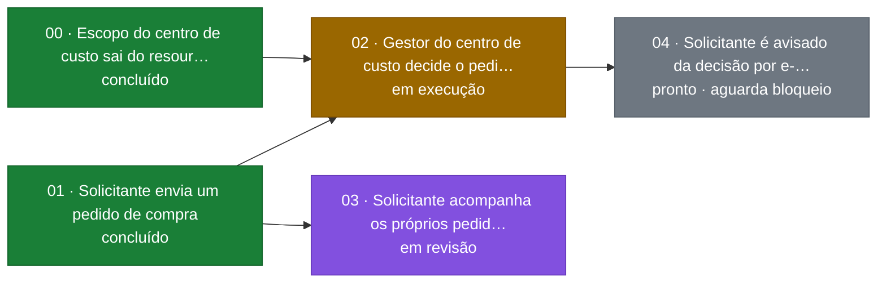

# feature-tickets — Fatias Verticais Ancoradas no Requisito

> **Status: nova — [`SKILL.md`](SKILL.md) v1.0.0 (2026-09-27).**
> Requer `feature-wiki` ≥ **4.0.0** e `feature-test-design` ≥ **1.16.0** — o porquê de cada versão
> mínima está em [Dependências](#dependências).
>
> **Para usar**: [Como chamar](#como-chamar) tem todas as invocações, com custo e exemplo, e com o
> caminho de uma wiki de exemplo em vez de marcador: copie e troque só o caminho da wiki. As saídas
> ali são reais. Há duas comparações lado a lado:
> [as duas formas de ver o status](#duas-formas-de-ver-o-status) e
> [as duas formas de executar um ticket](#duas-formas-de-executar-um-ticket).
>
> **`SKILL.md` fala com o agente; este README fala com a pessoa**: por que a skill existe, quando
> usar, como chamar, o que ela não faz e do que depende. Procedimento, regras, template do ticket e
> comandos estão só no `SKILL.md` e em [`references/`](references/).
>
> **Medição: nenhuma.** O critério de pronto do roteiro — uma feature de duas sessões entregue por
> tickets, com o quality gate no fim cruzando a coluna `Ticket` — ainda não foi exercitado. Os scripts
> foram testados com fixtures de wiki, não num projeto Laravel: `indice.sh` (conferência, quadro e
> status) e o `espelho-gh.sh`, cujo `--aplicar` rodou só contra um stub do `gh`, sem GitHub real. O
> grafo Mermaid gerado foi renderizado com o `@mermaid-js/mermaid-cli`. A fonte das tabelas de medição da coletânea
> é [`experimentos/README.md`](https://github.com/gsferro/laravel-ai-skills/blob/main/experimentos/README.md).

---

## Índice

- [Por que existe: a unidade de planejamento](#por-que-existe-a-unidade-de-planejamento)
- [Quando usar](#quando-usar)
- [Como chamar](#como-chamar)
  - [Como descobrir o caminho da wiki](#como-descobrir-o-caminho-da-wiki)
  - [Todas as invocações](#todas-as-invocações)
  - [Duas formas de ver o status](#duas-formas-de-ver-o-status)
  - [Duas formas de executar um ticket](#duas-formas-de-executar-um-ticket)
  - [Quadro no repositório e conferência](#quadro-no-repositório-e-conferência)
  - [Espelho no GitHub Projects](#espelho-no-github-projects)
- [O que ela entrega](#o-que-ela-entrega)
- [Diferença para a `/to-tickets`](#diferença-para-a-to-tickets)
- [Limites](#limites)
- [Dependências](#dependências)
- [Fontes](#fontes)

---

## Por que existe: a unidade de planejamento

O `01-plano-acao.md` da [`feature-wiki`](https://github.com/gsferro/laravel-ai-skills/blob/main/.ai/skills/feature-wiki/README.md)
fatia por **camada**: `### 1. Migration`, `### 2. Model`, `### 3. Policy`, `### 4. Tela`. É um bom
plano para quem implementa, e uma má unidade de trabalho:

- **Nada se demonstra até o último passo.** A migration sozinha não prova nada ao usuário; a tela só
  funciona quando todas as camadas abaixo dela existem.
- **A feature inteira roda numa sessão.** A feature medida em 2026-09-21 rodou numa sessão com
  **48 despachos e ~4,6 M tokens** ([estudo de 2026-09-26, §4.2](https://github.com/gsferro/laravel-ai-skills/blob/main/estudos/2026-09-26-agentskills-spec-to-spec-to-tickets.md#42-onde-a-coletânea-está-hoje--honestamente)).
  A recuperação depois de uma compactação funciona — o `03` guarda evidência inline —, mas retoma um
  **passo**, não uma fatia verificável.
- **O paralelismo é por arquivo, não por comportamento.** Dois construtores em camadas diferentes da
  mesma entrega produzem partes que só se provam juntas.
- **Não há ponto de revisão humana entre a wiki e o PR.** O desenvolvedor aprova o plano e depois vê
  o PR inteiro.

A `/to-tickets` ataca o mesmo problema com fatias verticais (*tracer bullets*). A página dela relata
26 tickets horizontais, cerca de 20 rodadas de agente por ticket fechado e três quartos de retrabalho —
número da página, não medido nesta coletânea.

O que a coletânea tem a mais é o `04`: os casos de teste existem **antes** de implementar, derivados do
requisito, com gate de falsificabilidade. Por isso aqui o ticket não inventa critério de aceite: ele é
**um subconjunto de `RQ` do `00` mais os `CT` do `04` que fazem esse subconjunto passar**. Daí saem de
graça o dimensionamento (quantos `RQ` e CT cabem numa sessão), as arestas de bloqueio (CT com origem
em dois tickets vai para o último) e o critério de aceite falsificável (o CT é vermelho antes, por
construção).

**Por que skill nova, e não um step da `feature-wiki`**: a `feature-wiki` já passa muito do tamanho que
o spec Agent Skills recomenda, e a `feature-tickets` tem gatilho próprio — só roda quando o plano não
cabe numa sessão (estudo §4.3).

## Quando usar

- **O step 8 da `feature-wiki` sugere**, porque o plano não cabe numa sessão. O desenvolvedor invoca
  `/feature-tickets wikis/specs/{branch}/{feature}` — por exemplo,
  `/feature-tickets wikis/specs/feature/ferro-830/aprovacao-compra`. A skill nunca se invoca sozinha
  (`disable-model-invocation: true`).
- **Refatoração larga** — renomear uma coluna, retipar um símbolo usado em muitos lugares. A
  `feature-wiki` agora aceita a wiki com `## Natureza da Wiki` = `refatoração` e sugere esta skill, que
  sequencia *expand → migrate em lotes → contract*.
- **Para executar um ticket**, numa sessão nova: o caminho da wiki e o número do ticket, como
  `/feature-tickets wikis/specs/feature/ferro-830/aprovacao-compra 04`.
- **Para acompanhar**: o quadro sai por script, sem o modelo escrever tabela — ver [Como chamar](#como-chamar).

Não é hora de usá-la quando **o plano cabe numa sessão** — fatiar custa um quiz, várias sessões e
vários fechamentos, e só compensa quando a sessão única estoura. Nem numa wiki sem `04`: sem casos de
teste não há onde ancorar o ticket. A lista completa está em [Quando Invocar](SKILL.md#quando-invocar).

## Como chamar

**Todos os comandos desta seção usam a mesma wiki**: branch `feature/ferro-830`, feature
`aprovacao-compra`. A wiki fica em `wikis/specs/{branch}/{feature}`, e a barra da branch vira
subpasta: `wikis/specs/feature/ferro-830/aprovacao-compra`. As skills estão em `.ai/skills`, onde o
Boost instala. Os comandos `bash` rodam na raiz do projeto, e a sessão do Claude Code é aberta nela.
Para usar, troque o caminho da wiki pelo da sua feature e copie o resto como está.

**Skill fora de `.ai/skills`**: troque só o começo do caminho do script, `.ai/skills/feature-tickets/…`
por `.claude/skills/feature-tickets/…` (espelho local, sem Boost) ou `~/.claude/skills/feature-tickets/…`
(global). O `/feature-tickets` não muda, porque a skill acha o próprio script. Com o caminho errado,
o bash responde `No such file or directory` (exit 127), e nada é lido.

As saídas desta seção são **reais**, rodadas em 2026-09-27 num projeto de exemplo: as duas skills
copiadas para `.ai/skills` e uma wiki completa (`00` a `04`) com cinco tickets. O `00` (prefactoring)
e o `01` estão concluídos, o `02` está em execução, o `03` em revisão e o `04` está pronto, bloqueado
pelo `02`. O projeto não tem Laravel: os scripts leem só a wiki. Onde a saída foi resumida, o corte
aparece como `…`.

### Como descobrir o caminho da wiki

Toda wiki tem um `03-progresso.md`. Na raiz do projeto:

```bash
find wikis/specs -name 03-progresso.md -exec dirname {} \;
```

No PowerShell, com o caminho relativo e barra normal (testado no PowerShell 7.6.6):

```powershell
Get-ChildItem -Recurse -Filter 03-progresso.md wikis/specs | ForEach-Object { (Resolve-Path -Relative $_.DirectoryName) -replace '^\.[\\/]', '' -replace '\\', '/' }
```

Os dois imprimem uma linha por wiki. No projeto de exemplo:

```text
wikis/specs/feature/ferro-830/aprovacao-compra
```

A forma curta do PowerShell, `… | ForEach-Object { $_.DirectoryName }`, também acha a wiki, mas
devolve o caminho absoluto (`C:\…\wikis\specs\feature\ferro-830\aprovacao-compra`).

### Todas as invocações

**Por que o custo em tokens está na tabela**: a etapa de tickets pode multiplicar o consumo, porque
cada ticket é uma sessão nova ou um despacho, com leitura da fatia, testes e fechamento. Ver o quadro
é a consulta mais frequente e não deve custar token de modelo. Por isso quem desenha o quadro é o
script, e a skill nunca o imprime sem pedido. Nenhum custo abaixo foi medido: a coluna diz de onde o
custo vem, não quanto é.

| Invocação | O que faz | Quando usar | Quem invoca | Custo em tokens | Exemplo de saída |
|---|---|---|---|---|---|
| `/feature-tickets wikis/specs/feature/ferro-830/aprovacao-compra` | **fatia**: lê `00`, `01`, `02` e `04`, propõe os tickets, faz o quiz, grava `07-tickets/`, roda o `--check` e gera os quadros | uma vez por feature, quando o step 8 da `feature-wiki` sugere, ou numa refatoração larga | o desenvolvedor | o maior da etapa de planejamento: uma sessão que lê a wiki e conversa no quiz | uma linha da proposta do quiz, escrita pelo agente (não é saída de script): `02 — gestor do centro de custo decide o pedido · bloqueado por: 00, 01 · RQ-02, RQ-03, P-01 · CT: 4` |
| `/feature-tickets wikis/specs/feature/ferro-830/aprovacao-compra 03` | **executa o ticket `03`** numa sessão nova: confere a fronteira, marca `em execução`, implementa só a fatia e fecha com os CT verdes | um ticket por vez, sempre numa sessão nova, e só ticket da fronteira | o desenvolvedor, ao abrir a sessão | uma sessão por ticket: é aqui que o consumo se multiplica | `03 → em revisão · 2/5 concluídos · fronteira: nenhum` ([como chegou lá](#duas-formas-de-executar-um-ticket)) |
| `/feature-tickets wikis/specs/feature/ferro-830/aprovacao-compra status` | roda `indice.sh --status` e responde **uma linha**; o quadro fica na saída recolhida do comando | quando já está conversando com a skill e basta o resumo | o desenvolvedor | carrega o `SKILL.md` no contexto e gera uma linha de resposta | `aprovacao-compra · 2/5 concluídos · em revisão: 03 · em execução: 02 · fronteira: nenhum` |
| `! bash .ai/skills/feature-tickets/scripts/indice.sh --status wikis/specs/feature/ferro-830/aprovacao-compra` | imprime o quadro inteiro na conversa, sem passar pelo modelo | **para acompanhar**, quantas vezes quiser | o desenvolvedor, no prompt do Claude Code | **zero token de saída do modelo** com `"respondToBashCommands": false`; sem essa configuração o Claude Code responde à saída, e a resposta custa um prompt normal ([detalhes](#duas-formas-de-ver-o-status)) | o quadro inteiro ([saída real](#duas-formas-de-ver-o-status)) |
| `bash .ai/skills/feature-tickets/scripts/indice.sh` | grava `wikis/specs/INDEX.md` (uma linha por feature, com a coluna `Progresso`) e o `07-tickets/README.md` de cada feature fatiada (barra, tabela, grafo Mermaid colorido por status) | sempre que quiser ver no GitHub ou no PR; a skill já roda ao gravar os tickets, a cada fechamento e no step 11 | a skill, sozinha; a pessoa, quando quiser | zero token de saída: a skill só vê a lista de paths | `wikis/specs/feature/ferro-830/aprovacao-compra/07-tickets/README.md` · `wikis/specs/INDEX.md` ([saída real](#quadro-no-repositório-e-conferência)) |
| `bash .ai/skills/feature-tickets/scripts/indice.sh --check wikis/specs/feature/ferro-830/aprovacao-compra` | confere os tickets contra o `00`, o `01`, o `03`, o `04` e o `05`: alocação única, forma, arestas, fatia vertical, costura, espelho no `03` | depois de editar um ticket à mão e antes de despachar; a skill roda sozinha ao gravar e ao fechar | a skill; a pessoa, quando quiser | zero token de saída: silêncio quando está tudo certo | nada (exit 0); com defeito, uma linha `arquivo:linha: mensagem` por achado (exit 1) ([saída real](#quadro-no-repositório-e-conferência)) |
| `bash .ai/skills/feature-tickets/scripts/espelho-gh.sh wikis/specs/feature/ferro-830/aprovacao-compra --project 7` | **espelho no GitHub Projects, dry-run** (o padrão): imprime os comandos `gh` que rodaria, sem chamar o `gh` nem gravar nada | antes de espelhar, para conferir o que vai acontecer | o desenvolvedor pede; a skill ou a pessoa roda | zero token de saída: o script escreve os comandos | `# 02 — Gestor do centro de custo decide o pedido · em execução → In Progress · sem issue: cria e grava **Issue** no ticket` |
| `bash .ai/skills/feature-tickets/scripts/espelho-gh.sh wikis/specs/feature/ferro-830/aprovacao-compra --project 7 --aplicar` | **executa**: uma issue por ticket (sem label), grava `**Issue**: #N` no ticket e move o item para a coluna do status; rodar de novo não duplica | só com pedido explícito, depois de ler o dry-run | o desenvolvedor pede; exige `gh auth status` ok | zero token de saída: o script chama o `gh` | `02: issue #43 (criada) · coluna In Progress` (contra um stub do `gh`, [ver abaixo](#espelho-no-github-projects)) |

**Limite dos três quadros** (repositório, chat e GitHub): o script lê arquivos e não roda testes. `CT
verdes` é inferido do `Status`: `em revisão` e `concluído` contam todos os CT do ticket, e `em
execução` mostra `—`. Quem prova que um CT passou é o fechamento do ticket, com a saída do Pest.

### Duas formas de ver o status

As duas rodam o mesmo `indice.sh --status` e mostram os mesmos números. A diferença é quem roda o
comando, o que aparece na conversa e quanto custa.

| | **(a) `!` no prompt — recomendada para acompanhar** | **(b) subcomando da skill** |
|---|---|---|
| O que digitar | `! bash .ai/skills/feature-tickets/scripts/indice.sh --status wikis/specs/feature/ferro-830/aprovacao-compra` | `/feature-tickets wikis/specs/feature/ferro-830/aprovacao-compra status` |
| Quem roda o comando | o Claude Code, direto: o `!` roda o comando na própria sessão, sem passar pelo modelo | a skill, que o agente carrega e executa |
| O que aparece na conversa | o quadro inteiro: resumo, barra, tabela por ticket e a linha de limite | uma linha escrita pelo agente; o quadro fica na saída recolhida do comando, que se abre na interface |
| Custo de modelo | **zero token de saída** com `"respondToBashCommands": false` no `settings.json`. A saída entra no contexto da sessão como qualquer comando `!` | a invocação carrega o `SKILL.md` no contexto, e o agente gera uma linha |
| Quando usar | para acompanhar, quantas vezes quiser, inclusive no meio de uma sessão de ticket | quando já está conversando com a skill e basta o resumo |

**(a)** Digite no prompt do Claude Code:

```text
! bash .ai/skills/feature-tickets/scripts/indice.sh --status wikis/specs/feature/ferro-830/aprovacao-compra
```

O quadro inteiro aparece na conversa. Saída real, sem corte:

```text
aprovacao-compra · 2/5 concluídos · em revisão: 03 · em execução: 02 · fronteira: nenhum
[########------------] 40 %  pronto 1 · em execução 1 · em revisão 1 · concluído 2
CT verdes (inferidos do Status): 5 de 11 (ticket em execução: —)

NN  STATUS       CT   BLOQUEADO POR  ENTREGA
00  concluído    —    —              Escopo do centro de custo sai do resource para o model
01  concluído    3/3  —              Solicitante envia um pedido de compra
02  em execução  —/4  00, 01         Gestor do centro de custo decide o pedido
03  em revisão   2/2  01             Solicitante acompanha os próprios pedidos
04  pronto       0/2  02             Solicitante é avisado da decisão por e-mail

limite: o script lê arquivos, não roda testes; CT verdes inferidos do Status; em execução mostra —
```

`fronteira: nenhum` porque o `02` está em execução, o `03` está em revisão e o `04` espera o `02`. O
`00` não tem CT (prefactoring fecha com a suíte existente), por isso a coluna mostra `—`.

**(b)** Digite no prompt do Claude Code:

```text
/feature-tickets wikis/specs/feature/ferro-830/aprovacao-compra status
```

O agente responde uma linha, que é a primeira da saída do script. O quadro fica na saída recolhida do
comando:

```text
aprovacao-compra · 2/5 concluídos · em revisão: 03 · em execução: 02 · fronteira: nenhum
```

**Atenção ao padrão do Claude Code.** Desde a v2.1.186, o Claude responde automaticamente à saída de
um comando `!`, e *"the response costs the same as sending a normal prompt"*. Para a forma (a) custar
zero token de modelo, ponha no `settings.json` do projeto (`.claude/settings.json`) ou do usuário:

```json
{
  "respondToBashCommands": false
}
```

Com essa configuração, a saída entra no contexto sem resposta. Sem ela, a forma (a) ainda mostra o
quadro inteiro, mas cada consulta custa uma resposta do modelo. Para custo zero sem mexer em
configuração, rode o mesmo `bash .ai/skills/feature-tickets/scripts/indice.sh --status …` num terminal
separado: nada entra na sessão. Fontes:
[Shell mode with `!` prefix](https://code.claude.com/docs/en/interactive-mode#shell-mode-with-prefix) e
[`respondToBashCommands`](https://code.claude.com/docs/en/settings-reference#respondtobashcommands),
lidos em 2026-09-27 (Claude Code 2.1.283 nesta máquina).

**Por que a skill não imprime o quadro sozinha** (regra de silêncio): sem pedido, ela nunca mostra a
tabela nem o grafo. Ao fechar ou mudar o status de um ticket, responde uma linha,
`NN → {status} · x/y concluídos · fronteira: …` — na wiki de exemplo,
`03 → em revisão · 2/5 concluídos · fronteira: nenhum`. O quadro completo está sempre a um `!` de
distância, ou no `07-tickets/README.md` do repositório.

### Duas formas de executar um ticket

A regra é a mesma nas duas: só ticket da **fronteira** é executado, e o executor recebe só a fatia (o
ticket, o `00`, o `02`, os passos do `01` do ticket e os CT do ticket).

| | **Sessão nova** | **`construtor` despachado** |
|---|---|---|
| Como chamar | abrir uma sessão nova e digitar `/feature-tickets wikis/specs/feature/ferro-830/aprovacao-compra 03` | a sessão que está com a feature despacha o sub-agente `construtor` da `feature-wiki` com o prompt de [`despacho-e-fechamento.md`](references/despacho-e-fechamento.md) |
| Quem marca `em execução` | a própria sessão nova, no arquivo do ticket; a linha do `03` fica `pronto` até o fechamento (única divergência que o `--check` aceita) | a sessão que despacha, no ticket e no `03` |
| Quem registra o custo | — (não há despacho) | a sessão que despacha, na coluna `Custo` de `## Despachos` do `03` |
| Quando usar | o padrão; também em host sem sub-agente | quando a sessão atual ainda tem folga e o ticket está na fronteira |
| Limite | a cegueira de fatia depende de a sessão seguir a instrução de abertura | o `construtor` tem `Read` e pode abrir outro ticket: cegueira por contexto entregue, não por construção |

**Exemplo, na wiki de exemplo.**

- **Sessão nova.** O `03` está `em revisão` porque uma sessão nova, aberta na raiz do projeto, recebeu

  ```text
  /feature-tickets wikis/specs/feature/ferro-830/aprovacao-compra 03
  ```

  e fechou o ticket com CT-08 e CT-09 verdes. A resposta de fechamento é uma linha, com os números do
  `--status` rodado depois da gravação (saída real, no estado da wiki de exemplo):

  ```text
  03 → em revisão · 2/5 concluídos · fronteira: nenhum
  ```

  Hoje nenhum ticket está na fronteira: com o mesmo comando para o `03` ou o `04`, a skill confere a
  fronteira e não executa. Quando o desenvolvedor aprova o `02`, a sessão grava `concluído` e
  responde (saída real, com o `02` passado a `concluído` numa cópia da wiki):

  ```text
  02 → concluído · 3/5 concluídos · fronteira: 04
  ```

  O próximo é o `04`, numa sessão nova: `/feature-tickets wikis/specs/feature/ferro-830/aprovacao-compra 04`.

- **`construtor` despachado.** Não há comando próprio. Na sessão que já está com a skill carregada
  (por exemplo, a que fatiou), peça em texto livre, como `despache o ticket 04 ao construtor`, depois
  que ele estiver na fronteira. A sessão confere a fronteira, monta o prompt de
  [`despacho-e-fechamento.md`](references/despacho-e-fechamento.md) e registra a linha em
  `## Despachos` do `03`. O fechamento responde a mesma linha.

O sinal de que um ticket era grande demais é a sessão dele **compactar**. Nesse caso, os próximos
tickets se dividem. Nenhum tamanho de ticket foi medido.

### Quadro no repositório e conferência

Na raiz do projeto, `bash .ai/skills/feature-tickets/scripts/indice.sh` grava os quadros e imprime o
que gravou. Saída real:

```text
wikis/specs/feature/ferro-830/aprovacao-compra/07-tickets/README.md
wikis/specs/INDEX.md
```

Trecho do `wikis/specs/feature/ferro-830/aprovacao-compra/07-tickets/README.md` gerado (o aviso do
topo foi cortado; o resto está igual):

````markdown
# Quadro dos tickets — `aprovacao-compra`

…

**Branch**: `feature/ferro-830` · **Wiki**: [`03-progresso.md`](../03-progresso.md) · **Todas as features**: [`INDEX.md`](../../../../INDEX.md)

## Progresso

`[████████░░░░░░░░░░░░] 40 %` — 2 de 5 tickets concluídos

| pronto | em execução | em revisão | concluído |
|---|---|---|---|
| 1 | 1 | 1 | 2 |

**Fronteira** (pode ser pego agora): nenhum · **CT verdes** (inferidos do `Status`): 5 de 11 (ticket em execução: —)

## Tickets

| NN | Entrega | Status | CT verdes | Bloqueado por |
|---|---|---|---|---|
| [00](00-prefactor-escopo-do-centro.md) | Escopo do centro de custo sai do resource para o model | concluído | — | — |
| [01](01-solicitante-envia-pedido.md) | Solicitante envia um pedido de compra | concluído | 3/3 | — |
| [02](02-gestor-decide-pedido.md) | Gestor do centro de custo decide o pedido | em execução | —/4 | 00, 01 |
| [03](03-solicitante-acompanha-pedidos.md) | Solicitante acompanha os próprios pedidos | em revisão | 2/2 | 01 |
| [04](04-solicitante-avisado-da-decisao.md) | Solicitante é avisado da decisão por e-mail | pronto | 0/2 | 02 |

## Dependências

Seta = "bloqueia". Cor e segunda linha de cada nó = status: verde concluído · roxo em revisão ·
âmbar em execução · azul pronto na fronteira · cinza pronto aguardando bloqueio · vermelho pergunta
ao solicitante aberta (seta pontilhada).


````

O `…` no fim dos rótulos do grafo é do script, que corta o título em 40 caracteres. No GitHub, o
bloco `mermaid` vira o grafo:


No `wikis/specs/INDEX.md`, a feature é uma linha da tabela (cabeçalho e linha reais; os links são
relativos a `wikis/specs/`):

```markdown
| Branch | Feature | 03 | Tickets | Progresso | Fronteira | Veredito do 06 | Wiki |
|---|---|---|---|---|---|---|---|
| `feature/ferro-830` | `aprovacao-compra` | 4/11 itens · em implementação | 5: pronto 1 · em execução 1 · em revisão 1 · concluído 2 | `[████░░░░░░] 40 %` 2/5 tickets | nenhum | — | [03](feature/ferro-830/aprovacao-compra/03-progresso.md) · [quadro](feature/ferro-830/aprovacao-compra/07-tickets/README.md) |
```

`4/11 itens` são os checkboxes marcados do `03`; `—` no veredito, porque a feature ainda não tem
`06-relatorio-qa.md`.

**`--check` sem defeito** fica em silêncio. Saída real:

```text
$ bash .ai/skills/feature-tickets/scripts/indice.sh --check wikis/specs/feature/ferro-830/aprovacao-compra
$ echo $?
0
```

**`--check` com defeito**: numa cópia da wiki, o `04` foi marcado `em execução` com o `02` ainda em
execução. Saída real:

```text
$ bash .ai/skills/feature-tickets/scripts/indice.sh --check wikis/specs/feature/ferro-830/aprovacao-compra
wikis/specs/feature/ferro-830/aprovacao-compra/07-tickets/04-solicitante-avisado-da-decisao.md:12: "em execução" com bloqueio pendente: 02 — só ticket da fronteira é despachado
$ echo $?
1
```

### Espelho no GitHub Projects

O script exige só o caminho da wiki. `--project 7` é o número do seu Project (o `7` da URL
`…/projects/7`); sem ele, o script só cria as issues. As issues vão para o repositório do diretório
atual (`--repo dono/repo` para outro), e o Project é do usuário logado no `gh` (`--owner` com o login
de uma organização para outro). As colunas e as demais opções estão no cabeçalho do
[`espelho-gh.sh`](scripts/espelho-gh.sh).

**Dry-run** (o padrão):

```text
bash .ai/skills/feature-tickets/scripts/espelho-gh.sh wikis/specs/feature/ferro-830/aprovacao-compra --project 7
```

Saída real, resumida: os blocos dos tickets `00`, `01`, `03` e `04` têm a mesma forma do `02`.

```text
# espelho-gh.sh — DRY-RUN: nada foi executado. Para executar, o mesmo comando com --aplicar.
# wiki: wikis/specs/feature/ferro-830/aprovacao-compra · 5 tickets · repo: o do diretório atual · project 7 (dono @me, campo Status)
# colunas: pronto → Todo · em execução → In Progress · em revisão → In Progress · concluído → Done
# nenhuma label: label de estado dispara automação (ready-for-agent); a issue é espelho de mão única.
gh auth status

# ids do Project, resolvidos uma vez no --aplicar
gh project view 7 --owner '@me' --format json --jq .id
gh project field-list 7 --owner '@me' --format json --jq '.fields[] | select(.name=="Status") | .id'
…

# 00 — Escopo do centro de custo sai do resource para o model · concluído → Done · sem issue: cria e grava **Issue** no ticket
…

# 02 — Gestor do centro de custo decide o pedido · em execução → In Progress · sem issue: cria e grava **Issue** no ticket
gh issue create --title '02: Gestor do centro de custo decide o pedido' --body-file - <<'CORPO'
Espelho de `wikis/specs/feature/ferro-830/aprovacao-compra/07-tickets/02-gestor-decide-pedido.md` — o arquivo do ticket é a fonte; esta issue não é sincronizada de volta.

**Entrega**: o gestor do centro de custo aprova, ou recusa com motivo; gestor de outro centro não consegue.
**RQ cobertas**: RQ-02, RQ-03, P-01
**CT que ficam verdes**: CT-04, CT-05, CT-06, CT-07
**CT-B**: —
**Costura**: Decisão — Pest feature HTTP

Blocked by #{issue do ticket 00}
Blocked by #{issue do ticket 01}
CORPO
# grava "**Issue**: #{número}" em wikis/specs/feature/ferro-830/aprovacao-compra/07-tickets/02-gestor-decide-pedido.md, abaixo do **Status**
gh project item-add 7 --owner '@me' --url {URL impressa pelo gh issue create} --format json --jq .id
gh project item-edit --id {id do item do ticket 02} --project-id {id do Project 7} --field-id {id do campo Status} --single-select-option-id {id da opção "In Progress"}
…
```

O dry-run não chama o `gh` e não grava nada: os tickets saíram com o mesmo md5 com que entraram.

**Executar**, só com pedido explícito, depois de ler o dry-run:

```text
bash .ai/skills/feature-tickets/scripts/espelho-gh.sh wikis/specs/feature/ferro-830/aprovacao-compra --project 7 --aplicar
```

Saída real **contra um stub do `gh`**, não contra o GitHub: o stub devolve issues numeradas a partir
de `#41`, e no GitHub os números são os do repositório.

```text
00: issue #41 (criada) · coluna Done
01: issue #42 (criada) · coluna Done
02: issue #43 (criada) · coluna In Progress
03: issue #44 (criada) · coluna In Progress
04: issue #45 (criada) · coluna Todo
```

Cada ticket ganhou `**Issue**: #N` logo abaixo do `**Status**` (no `02`, `**Issue**: #43`), e o
`--check` continuou em silêncio. Rodar de novo não cria issue: a saída perde o `(criada)`
(`02: issue #43 · coluna In Progress`), e a coluna de cada item é reaplicada — só muda a do ticket
cujo `Status` mudou. Nenhuma chamada levou `--label`.

## O que ela entrega

- **`07-tickets/NN-slug.md`** na pasta da feature, um por ticket, numerados em ordem de dependência. O
  prefactoring, quando existe, é o `00`. Cada ticket diz a entrega (do ponto de vista do usuário), os
  `RQ` e `P-nn` que cobre, os CT e CT-B que ficam verdes, os passos do `01` envolvidos (por número e
  link, não cópia), as arestas, a costura de teste e o status.
- **Um quiz antes de gravar**: a proposta numerada e perguntas com recomendação sobre granularidade,
  arestas, prefactoring e tamanho. O desenvolvedor aprova; a pergunta que é de requisito vai para o
  solicitante, pelo `00`.
- **Achados de plano**: `RQ`, `P-nn` ou CT sem ticket; `RQ` substituída ou decomposta num ticket; ticket
  que não fecha vertical; CT que ficaria verde antes do ticket dele; `RQ` aberta num ticket sem o
  bloqueio da pergunta.
- **`## Tickets` no `03`**, uma linha por ticket, espelhando o `Status`.
- **Quadros gerados por script**: `07-tickets/README.md` por feature (barra de progresso, contagem por
  status, fronteira, tabela por ticket e o grafo de dependências em Mermaid, que o GitHub desenha) e
  `wikis/specs/INDEX.md` entre todas as features (estado do `03`, tickets por status, progresso,
  fronteira e veredito do `06`). Os dois são determinísticos e sem data.
- **Espelho opcional no GitHub Projects** (`espelho-gh.sh`): dry-run por padrão, idempotente pelo campo
  `**Issue**` do ticket, sem label de estado.
- **Um ponto de revisão humana por entregável**: o ticket entra `em revisão` quando os CT dele ficam
  verdes, e só o desenvolvedor o marca `concluído`.

## Diferença para a `/to-tickets`

| | `/to-tickets` | `feature-tickets` |
|---|---|---|
| De onde sai o ticket | da conversa ou de uma spec sintetizada | do `00` (requisito bruto decomposto em `RQ`) e do `04` (CT derivados do requisito) |
| Critério de aceite | escrito em prosa por ticket | os CT do `04` listados no ticket — vermelhos antes, por construção |
| Omissão | não há como detectar pedido sem ticket | todo `RQ`, `P-nn` e CT em exatamente um ticket; o `--check` acusa o que sobra |
| Pedido ambíguo | o desenvolvedor responde no quiz | vai ao solicitante; o ticket fica bloqueado pela pergunta |
| Onde vive | `.scratch/`, fora do controle de versão, ou no tracker | na wiki da feature, que vai no PR; tracker só como espelho opcional |
| Estado | label `ready-for-agent` | campo `Status` no arquivo; `em execução` é marcado por quem despacha |
| Cegueira | sessão nova por ticket | sessão nova ou `construtor` que recebe só a fatia (ticket, `00`, `02`, passos do ticket, CT do ticket) |
| Quadro | o tracker | `07-tickets/README.md` com grafo e `wikis/specs/INDEX.md`, gerados por script; GitHub Projects só como espelho |
| Refatoração larga | expand → migrate em lotes → contract | a mesma sequência, com exemplo Laravel e as armadilhas do Eloquent |

O que **não** foi importado, e por quê (estudo §4.4): critério de aceite em prosa (o `04` já é mais
forte, e prosa tende a reafirmar o pedido); tickets fora do controle de versão; label automática de
estado — o próprio autor da `to-tickets` relata que ela disparou execução indevida.

## Limites

- **Os limiares são hipótese.** "Não cabe numa sessão" é o critério do step 8 da `feature-wiki`, que
  descreve uma feature inteira. O tamanho de um ticket **não** usa esses limiares: é julgado no quiz,
  com o sinal de retorno "a sessão do ticket compactou → dividir os próximos". O tamanho de um lote de
  migrate também. Nenhum deles foi medido.
- **A cegueira de fatia é por contexto entregue, não por construção.** O `construtor` recebe só a
  fatia, mas tem `Read` e pode abrir outro ticket; o hook `guarda-subagente.sh` da `feature-wiki` não
  tem perfil para ele. A sessão nova segue a instrução de abertura.
- **O `--check` confere alocação, forma e arestas; não julga a granularidade.** Quem julga se um ticket
  está grande ou pequeno demais é o quiz com o desenvolvedor.
- **O script lê as tabelas no formato dos templates.** Tabela fora do formato vira achado ("… não
  conferida"), nunca silêncio — mas o conteúdo de uma tabela bem formada com a semântica errada não é
  detectado.
- **Os quadros não rodam testes.** `CT verdes` é inferido do `Status`; ticket `em execução` mostra `—`.
- **O "zero token" da forma (a) depende de configuração**: com o padrão atual do Claude Code, o
  modelo responde à saída de um `!` ([detalhes](#duas-formas-de-ver-o-status)).
- **Expand–contract é a exceção declarada à fatia vertical**: expand e migrate não entregam cláusula, e
  o `--check` não confere a origem dos CT deles.
- **O `INDEX.md` e o `07-tickets/README.md` conflitam entre branches paralelas**, porque cada branch os
  regenera. O conflito se resolve rodando o script de novo, nunca à mão.
- **Enquanto uma sessão nova executa um ticket, a linha dele no `03` fica `pronto`**: a sessão nova não
  abre o `03` até o fechamento. O `--check` aceita essa divergência, e só essa; os quadros, que leem os
  arquivos dos tickets, mostram `em execução`.
- **O espelho no GitHub é opcional, de mão única e envelhece** quando o `Status` muda no arquivo: rodar
  o `espelho-gh.sh` de novo move a coluna. O `--aplicar` rodou só contra um stub do `gh` (criação das
  issues, gravação do `**Issue**` com LF e com CRLF, idempotência); contra o GitHub real, não.
- **Não substitui o que é por feature**: a revisão do diff (step 9), a reconciliação (step 10) e o
  quality gate (step 11) rodam uma vez, depois do último ticket.
- **`disable-model-invocation` é extensão do Claude Code**, fora do spec Agent Skills: o
  `skills-ref validate` rejeita o campo, e a CI precisa tolerá-lo. Em host que ignora o campo, nada
  impede o modelo de ativar a skill pela `description` — que diz, por isso, "só o usuário invoca".

## Dependências

| Item | Versão mínima | Para quê | Sem ele |
|---|---|---|---|
| [`feature-wiki`](https://github.com/gsferro/laravel-ai-skills/blob/main/.ai/skills/feature-wiki/README.md) | **4.0.0** | produz `00`–`03`; sugere esta skill no step 8 e retoma a feature no step 9; `P-nn`, `## Perguntas ao Solicitante`, `RQ` `aberta — Qn` e `decomposta em …` no `00`; `rastreabilidade.sh` (gate de entrada); rotas `construtor` e `executor-ct`; `## Natureza da Wiki` = `refatoração` | não suportada: sem `Qn` a `RQ` ambígua não tem onde bloquear, e sem o `rastreabilidade.sh` o gate de entrada não existe |
| [`feature-test-design`](https://github.com/gsferro/laravel-ai-skills/blob/main/.ai/skills/feature-test-design/README.md) | **1.16.0** | o `04` com `## Costuras de Teste`, a coluna `Costura` no `## Índice de Cenários` e `P-nn` na origem dos CT | a skill para no gate de entrada |
| `bash` e `php` no PATH | — (todo projeto Laravel tem `php`) | `scripts/indice.sh` (`--check`, `--status`, quadros) e `scripts/espelho-gh.sh` | a alocação é conferida à mão e a degradação é declarada numa linha da `## Tickets` do `03`; nenhum quadro é gerado |
| Pest 5 | 5 | `--parallel --tia` no fechamento de cada ticket | suíte completa contra a baseline (Pest 4) |
| Claude Code com sub-agentes | — | despachar `executor-ct` e `construtor` com só a fatia | cada ticket roda numa sessão nova |
| `gh` (GitHub CLI), autenticado | — (sintaxe conferida no 2.83.0 e no manual atual) | `espelho-gh.sh --aplicar` | sem espelho; o dry-run não precisa do `gh`, e o arquivo é a fonte de qualquer jeito |

**Por que `feature-wiki` ≥ 4.0.0.** A 4.0.0 renumera os steps (o fatiamento é o 8; revisão do diff,
reconciliação e quality gate passam a 9, 10 e 11), cria `## Premissas` e `## Perguntas ao Solicitante`
no `00`, marca `RQ` aberta e bloqueia o passo do `01` que depende dela, traz o `rastreabilidade.sh` e
aceita wiki de refatoração. A `feature-tickets` usa tudo isso.

**Por que `feature-test-design` ≥ 1.16.0.** É a versão que acrescenta `## Costuras de Teste` ao `04` —
o campo `**Costura**` do ticket é uma linha dessa tabela, e o `--check` a confere pela coluna `Costura`
do `## Índice de Cenários` — e aceita `P-nn` como origem de CT.

## Fontes

- Estudo [`2026-09-26-agentskills-spec-to-spec-to-tickets.md`](https://github.com/gsferro/laravel-ai-skills/blob/main/estudos/2026-09-26-agentskills-spec-to-spec-to-tickets.md) — §4.1 (mecânica da `to-tickets`), §4.2 (lacunas da coletânea), §4.3 (a proposta), §4.4 (o que não importar), §5.1 (estado *em revisão*), §8 itens 12 e 14.
- `mattpocock/skills` — [`skills/engineering/to-tickets/SKILL.md`](https://github.com/mattpocock/skills/blob/main/skills/engineering/to-tickets/SKILL.md) (lido em 2026-09-26).
- aihero.dev — [*The /to-tickets skill*](https://www.aihero.dev/skills-to-tickets).
- Vídeo [*"meu fluxo de trabalho com IA"*](https://www.youtube.com/watch?v=1bmO4BaVclY) — a tese do estado *em revisão* como ponto de entrada do humano.
- Claude Code — [Shell mode with `!` prefix](https://code.claude.com/docs/en/interactive-mode#shell-mode-with-prefix) e [`respondToBashCommands`](https://code.claude.com/docs/en/settings-reference#respondtobashcommands) (lidos em 2026-09-27).
- GitHub CLI — [manual](https://cli.github.com/manual) (`gh issue create`, `gh project item-add`, `gh project item-edit`, `gh project field-list`; lido em 2026-09-27) e [Using the API to manage Projects](https://docs.github.com/en/issues/planning-and-tracking-with-projects/automating-your-project/using-the-api-to-manage-projects).
