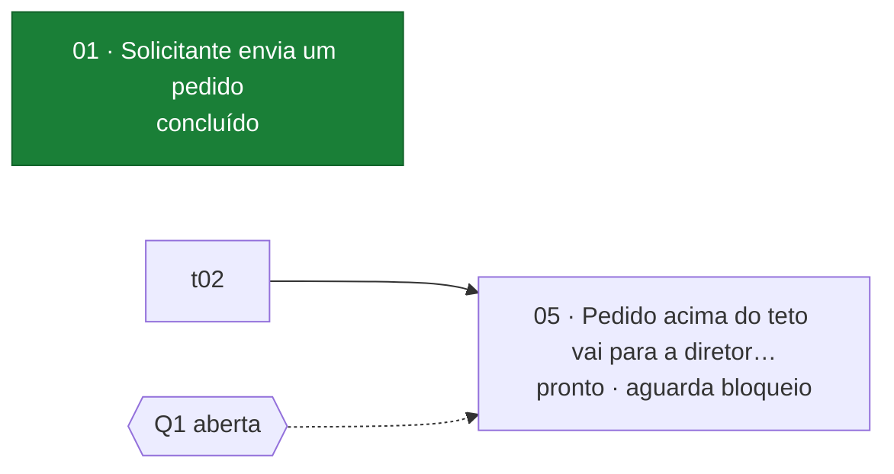

> Referência da feature-tickets 1.0.0. Lida em: subcomando `status`; fechamento de ticket (a linha
> única da resposta); quando o usuário pede o espelho no GitHub. Fonte única de: o formato do
> `indice.sh --status`, do `07-tickets/README.md` e da coluna `Progresso` do `INDEX.md`; as cores do
> grafo; o uso do `espelho-gh.sh`, com a sintaxe do `gh` conferida.

# Visualização dos tickets

As obrigações estão no `SKILL.md`, seção *Visualização e Regra de Silêncio*. Aqui ficam os formatos e
os comandos. **Quem desenha o quadro é o script, nunca o modelo.** O quadro sai dos arquivos dos
tickets, de forma determinística, e custa zero token de saída. Uma tabela de ticket escrita pelo
modelo custaria tokens a cada pedido e poderia divergir do arquivo, que é a fonte.

| Nível | Onde aparece | Quem gera | Quando | Custo de modelo |
|---|---|---|---|---|
| Repositório | `{wiki}/07-tickets/README.md` e `wikis/specs/INDEX.md` | `indice.sh` sem argumento | no passo 7 (gravar), a cada fechamento de ticket e no step 11 da `feature-wiki` | nenhum: a skill roda o comando e só vê a lista de paths |
| Chat | a saída do comando na conversa | `indice.sh --status {wiki}` | **só quando o usuário pede** | zero pelo `!` do Claude Code com `respondToBashCommands: false`; uma linha pelo subcomando `status` |
| GitHub Projects | issues e colunas do Project | `espelho-gh.sh` | **só quando o usuário pede**; dry-run por padrão | a skill roda o comando; `--aplicar` só com pedido explícito |

**Limite dos três**: o script lê arquivos e não roda testes. `CT verdes` é inferido do `Status`: `em
revisão` e `concluído` contam todos os CT do ticket como verdes, `pronto` conta nenhum, e `em
execução` mostra `—`. Quem prova que um CT está verde é o fechamento do ticket, com a saída do Pest
([`despacho-e-fechamento.md`](despacho-e-fechamento.md#fechamento)).

## 1. Repositório — `07-tickets/README.md` e `INDEX.md`

`bash {skills}/feature-tickets/scripts/indice.sh`, na raiz do projeto, grava para cada feature fatiada
o `{wiki}/07-tickets/README.md` e depois o `wikis/specs/INDEX.md`, e imprime os paths gravados. A saída
não tem data, e rodar de novo sem mudança na wiki não altera nenhum arquivo. Conflito de merge nesses
arquivos se resolve rodando o script de novo. O `--check` ignora o `README.md`, porque ele não é
ticket. Feature que perde todos os tickets perde também o `README.md` gerado.

O `README.md` tem quatro partes:

1. **Progresso**: barra de 20 posições (tickets `concluído` / total, arredondada para baixo: 100 % só
   com todos concluídos) e contagem por status.
2. **Fronteira e CT verdes**: os tickets que podem ser pegos agora; CT verdes / CT dos tickets.
3. **Tickets**: `| NN | Entrega | Status | CT verdes | Bloqueado por |`. `NN` é link para o ticket, a
   entrega é o título `# NN:`, e `CT verdes` aparece como `4/4`, `0/1`, `—/1` (em execução) ou `—`
   (ticket sem CT). Em `Bloqueado por`, cada `Qn` leva o estado do `00`: `Q1 (aberta)`.
4. **Dependências**: grafo `flowchart LR` em Mermaid, que o GitHub desenha. Cada ticket é um nó
   `NN · {entrega}`, com o status na segunda linha. A seta vai do bloqueador para o bloqueado, e cada
   `Qn` aberta é um hexágono vermelho com seta pontilhada. `Qn` citada em `**Bloqueado por**` que não
   está no `00` vira hexágono de borda vermelha tracejada, `Qn não está no 00` (o `--check` acusa):
   o grafo não afirma um estado que o `00` não tem.

Trecho do arquivo gerado (fixture de 2026-09-27; o grafo completo tem um nó por ticket):

````markdown
`[████░░░░░░░░░░░░░░░░] 20 %` — 1 de 5 tickets concluídos

**Fronteira** (pode ser pego agora): 04 · **CT verdes** (inferidos do `Status`): 7 de 9 (ticket em execução: —)


````

**Cores**: nó preenchido com texto de cor fixa, legível nos temas claro e escuro do GitHub, que só
trocam o fundo e as setas. O contraste foi calculado pela fórmula do WCAG 2.x, e todas as cores ficam
acima de 4,5:1 (nível AA para texto normal). A cor nunca é a única pista: o status também vai escrito
no nó.

| Classe | Status | Preenchimento | Texto | Contraste |
|---|---|---|---|---|
| `concluido` | concluído | `#1a7f37` verde | `#ffffff` | 5,08:1 |
| `revisao` | em revisão | `#8250df` roxo | `#ffffff` | 5,05:1 |
| `execucao` | em execução | `#9a6700` âmbar | `#ffffff` | 4,87:1 |
| `pronto` | pronto, na fronteira | `#0969da` azul | `#ffffff` | 5,19:1 |
| `aguarda` | pronto, com bloqueio pendente | `#6e7781` cinza | `#ffffff` | 4,55:1 |
| `pergunta` | `Qn` aberta no `00` | `#cf222e` vermelho | `#ffffff` | 5,36:1 |
| `invalido` | status fora do enum; `Qn` citada que não está no `00` | `#ffffff`, borda tracejada | `#cf222e` | 5,36:1 |

Os caracteres `"`, `#`, `<`, `>` e `&` da entrega entram no rótulo como entidade Mermaid (`#quot;`,
`#35;`, `#lt;`, `#gt;`, `#amp;`), e o rótulo corta em 40 caracteres. A sintaxe foi conferida em
2026-09-27 renderizando o grafo gerado com o `@mermaid-js/mermaid-cli` 11, nos temas `default` e
`dark`, e de novo com o 12.0.0, nos dois temas, depois do nó de `Qn` que não está no `00`. Um grafo
com sintaxe quebrada, no mesmo teste, falhou com `Parse error`.

**`INDEX.md`**, a coluna `Progresso`: `` `[██░░░░░░░░] 20 %` 1/5 tickets `` para feature fatiada.
Feature não fatiada usa os itens marcados do `03`, e a célula diz a unidade: `` `[██████░░░░] 66 %` do 03 ``.
A coluna `Wiki` ganha o link `quadro` para o `07-tickets/README.md`.

## 2. Chat — `indice.sh --status {wiki}`

Imprime a visão compacta no stdout e não grava nada. Saída real (fixture de 2026-09-27):

```text
aprov · 1/5 concluídos · em revisão: 02 · em execução: 03 · fronteira: 04
[####----------------] 20 %  pronto 2 · em execução 1 · em revisão 1 · concluído 1
CT verdes (inferidos do Status): 7 de 9 (ticket em execução: —)

NN  STATUS       CT   BLOQUEADO POR    ENTREGA
01  concluído    3/3  —                Solicitante envia um pedido
02  em revisão   4/4  01               Aprovador do centro decide o pedido
03  em execução  —/1  01               Solicitante recebe e-mail com link
04  pronto       0/1  01               Solicitante cancela o pedido ainda não decidido
05  pronto       —    02, Q1 (aberta)  Pedido acima do teto vai para a diretoria

limite: o script lê arquivos, não roda testes; CT verdes inferidos do Status; em execução mostra —
```

A primeira linha é o resumo. Ela é a linha que a skill devolve no subcomando `status`. Wiki sem
tickets devolve uma linha só: `{feature} · não fatiada (sem tickets em 07-tickets/) · 03: 2/3 itens`.

**Duas formas de pedir**:

| | `! bash {skills}/feature-tickets/scripts/indice.sh --status {wiki}` | `/feature-tickets {wiki} status` |
|---|---|---|
| Quem roda | o usuário digita no prompt do Claude Code; o `!` roda o comando na própria sessão | a skill roda o mesmo comando |
| O que aparece | o quadro inteiro, na conversa | uma linha escrita pelo agente; o quadro fica na saída recolhida do comando |
| Custo de modelo | zero token de saída do modelo com `"respondToBashCommands": false` no `settings.json`; sem isso, o Claude Code responde à saída (custo de um prompt normal) | a invocação carrega o `SKILL.md` e gera uma linha de resposta |
| Quando usar | para acompanhar, quantas vezes quiser | quando já está conversando com a skill e basta o resumo |

O padrão do `respondToBashCommands` é `true` desde o Claude Code 2.1.186: *"Claude responds to the
command output automatically once it lands in the transcript […] The response costs the same as
sending a normal prompt"* ([Shell mode with `!` prefix](https://code.claude.com/docs/en/interactive-mode#shell-mode-with-prefix);
[`respondToBashCommands`](https://code.claude.com/docs/en/settings-reference#respondtobashcommands),
lidos em 2026-09-27). Para custo zero sem configuração, o mesmo comando num terminal separado.

**Resposta de uma linha**:

- subcomando `status`: a primeira linha do `--status`, sem recopiar a tabela;
- ao fechar ou mudar o status de um ticket: `NN → {status} · x/y concluídos · fronteira: {…}`, com os
  números tirados do `--status` rodado depois da gravação. Exemplo, com a fixture acima: `02 → concluído · 2/5 concluídos · fronteira: 04`
  (o 05 continua fora da fronteira: espera a Q1).

## 3. GitHub Projects — `espelho-gh.sh`

Só quando o usuário pede. O arquivo do ticket é a fonte, e a issue é espelho de mão única: nada volta
da issue para o ticket, fora o número gravado no campo `**Issue**`.

```bash
# 1. DRY-RUN (padrão): imprime os comandos gh que rodaria; não chama o gh nem grava nada
bash {skills}/feature-tickets/scripts/espelho-gh.sh {wiki} --project 7 --owner {dono}

# 2. só depois de o usuário ler o dry-run e pedir: executa
bash {skills}/feature-tickets/scripts/espelho-gh.sh {wiki} --project 7 --owner {dono} --aplicar
```

| Opção | Variável | Padrão | Para quê |
|---|---|---|---|
| `--repo DONO/REPO` | `FT_GH_REPO` | o repositório do diretório atual | onde as issues nascem |
| `--project N` | `FT_GH_PROJECT` | — (sem Project: só issues) | o Project que recebe os itens |
| `--owner LOGIN` | `FT_GH_OWNER` | `@me` | dono do Project |
| `--campo NOME` | `FT_GH_CAMPO` | `Status` | campo single select que faz as colunas |
| `--coluna pronto=X` | `FT_GH_COL_PRONTO` | `Todo` | coluna do ticket `pronto` |
| `--coluna execucao=X` | `FT_GH_COL_EXECUCAO` | `In Progress` | coluna do ticket `em execução` |
| `--coluna revisao=X` | `FT_GH_COL_REVISAO` | `In Progress` | coluna do ticket `em revisão` (quem tem `In Review` passa `revisao=In Review`) |
| `--coluna concluido=X` | `FT_GH_COL_CONCLUIDO` | `Done` | coluna do ticket `concluído` |

Os padrões são as opções do campo `Status` do modelo de Project do GitHub. O argumento vence a variável.

**O que o `--aplicar` faz, por ticket, em ordem de número:**

1. roda `indice.sh --check {wiki}` antes de tudo e não espelha se houver achado (exit 1);
2. exige `gh auth status` com exit 0;
3. ticket sem `**Issue**`: `gh issue create --title "NN: {entrega}" --body-file -`, com corpo de
   Entrega, RQ cobertas, CT, CT-B, Costura e uma linha `Blocked by #N` por bloqueador (a `Qn` aberta
   entra como texto, porque pergunta não tem issue). Depois grava `**Issue**: #N` no ticket, logo
   abaixo do `**Status**`. Ticket com `**Issue**` não ganha issue nova;
4. com `--project`: `gh project item-add` com a URL da issue (se o item já existe, o GitHub devolve o
   mesmo) e `gh project item-edit` com a opção da coluna.

Rodar de novo não duplica nada. Se o `gh` falha no meio, o script sai com exit 2, as issues já criadas
ficam gravadas nos tickets, e a próxima rodada continua dali. **Nunca**: `--label` (label de estado
dispara automação, como a `ready-for-agent` da `to-tickets`), fechar issue, ou ler estado da issue de
volta para o ticket.

**Sintaxe conferida em 2026-09-27** no manual oficial do GitHub CLI e no `gh` 2.83.0 instalado:

| Comando | Forma usada | Fonte |
|---|---|---|
| `gh issue create` | `--title`, `--body-file -` (lê o corpo do stdin), `--repo`; imprime a URL da issue no stdout | [cli.github.com/manual/gh_issue_create](https://cli.github.com/manual/gh_issue_create) |
| `gh project item-add` | `gh project item-add N --owner LOGIN --url URL --format json --jq .id` | [cli.github.com/manual/gh_project_item-add](https://cli.github.com/manual/gh_project_item-add) |
| `gh project item-edit` | `--id ITEM --project-id PROJETO --field-id CAMPO --single-select-option-id OPÇÃO` | [cli.github.com/manual/gh_project_item-edit](https://cli.github.com/manual/gh_project_item-edit) |
| `gh project field-list` | `gh project field-list N --owner LOGIN --format json`; saída `{"fields":[{"id","name","type","options":[{"id","name"}]}]}` | [cli.github.com/manual/gh_project_field-list](https://cli.github.com/manual/gh_project_field-list); forma do JSON: testes do `cli/cli` (`pkg/cmd/project/shared/queries/export_data_test.go`) |
| item repetido | *"If you try to add an item that already exists, the existing item ID is returned instead."* | [docs.github.com — Using the API to manage Projects](https://docs.github.com/en/issues/planning-and-tracking-with-projects/automating-your-project/using-the-api-to-manage-projects) |

O manual atual também aceita `gh project item-edit --url … --field "Status" --value "…"`, pelo nome.
O `gh` 2.83.0 não tem essas flags, e por isso o script usa a forma por id, que existe nas duas versões.
Os filtros de JSON usam o `--jq` embutido no próprio `gh`, sem o binário `jq`.
