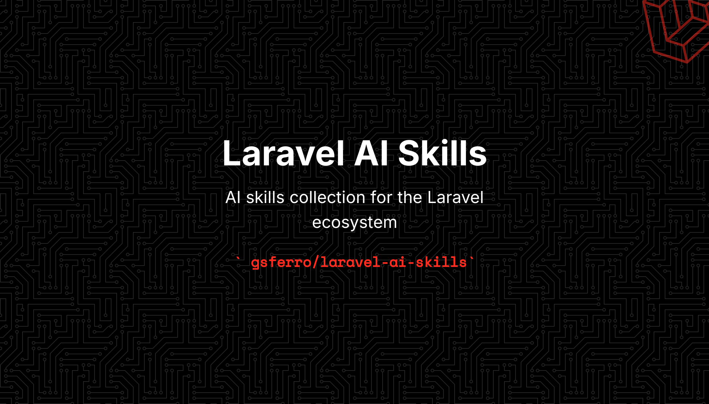

<p align="center">
  
</p>

# Laravel AI Skills Collection 🚀

Uma coletânea de diretrizes de inteligência artificial (Skills) personalizadas para o ecossistema Laravel, focada em boas práticas de arquitetura de software e design patterns.

Estas skills servem para instruir agentes de IA e IDEs avançadas (como Claude Code, Cursor e Copilot) a gerarem códigos exatamente de acordo com os padrões definidos neste repositório.

## 📚 Skills desta coletânea

| Skill | Versão | O que faz | Quando é invocada |
|---|---|---|---|
| [`feature-wiki`](.ai/skills/feature-wiki/SKILL.md) | 2.7.0 | Cria a wiki da feature antes de implementar: PRD, ADR, progresso, casos de teste (backend e browser) e padrão de log | ao iniciar qualquer feature nova |
| [`requirement-to-rule`](.ai/skills/requirement-to-rule/SKILL.md) | 1.0.0 | Transforma decisão/restrição do requisito em **Project Rule** do Laravel Boost (`.ai/rules/`), com aprovação do usuário | no fim da feature (step 8 da `feature-wiki`) ou sob pedido |

O ciclo completo: **planejar** (`feature-wiki`) → **executar** (Ponytail) → **comunicar** (Caveman) → **validar** (Pest 5 + CT-B) → **memorizar** (`requirement-to-rule`).

> Histórico de evolução das duas skills: [CHANGELOG.md](CHANGELOG.md)

---

## 🏗️ Estrutura do Repositório (Como criar novas Skills)

Para que o Laravel Boost e o Claude Code consigam detectar suas habilidades automaticamente, elas **devem** seguir rigorosamente a estrutura de pastas abaixo dentro do repositório:

```text
.ai/
└── skills/
    ├── nome-da-sua-skill/
    │   └── SKILL.md
    └── outra-skill/
        └── SKILL.md
```

### Regras importantes para o arquivo `SKILL.md`:
Todo arquivo `SKILL.md` precisa começar obrigatoriamente com um cabeçalho **YAML** delimitado por `---`. É isso que descreve a habilidade para a inteligência artificial.

**Exemplo prático de um arquivo `SKILL.md`:**
```markdown
---
name: Form Requests Padronizados
description: Diretrizes para validação de dados usando Form Requests isolados no domínio do projeto.
---

# Diretrizes da Skill
- Sempre utilize o comando `php artisan make:request`.
- Nunca faça validações diretamente dentro das Controllers.
- Adicione mensagens de erro customizadas no método `messages()`.
```

---

## ⚙️ Como Instalar no Laravel Boost 2.0

Para adicionar as habilidades deste repositório diretamente no seu projeto Laravel atual, execute o comando abaixo no terminal da raiz do seu projeto:

```bash
php artisan boost:add-skill gsferro/laravel-ai-skills
```

Isso fará o download automático de todas as pastas de habilidades para o diretório `.ai/skills/` do seu projeto. Para garantir que as atualizações locais sejam processadas, você pode rodar:

```bash
php artisan boost:update
```
> Após instalar, veja [Padrão de Commit](#-padrão-de-commit-ao-instalaratualizar-skills).    

---

## 🤖 Como Instalar no Claude Code

Você pode disponibilizar e carregar essas diretrizes no **Claude Code** através de três abordagens diferentes:

### Opção 1: Uso Local por Projeto (Recomendado)
Se você já executou o comando do Laravel Boost acima no seu projeto, basta criar um espelho das configurações para que o Claude Code dê prioridade a elas no repositório local:

```bash
mkdir -p .claude/skills/
cp -R .ai/skills/* .claude/skills/
```

### Opção 2: Instalação Global no Sistema
Para que o Claude Code use estas regras de arquitetura em **qualquer diretório** que você abrir na sua máquina, instale a pasta de skills diretamente no seu perfil de usuário:

* **Linux / macOS:**
  ```bash
  mkdir -p ~/.claude/skills/
  # Clone o repositório e mova o conteúdo para a pasta global
  cp -R .ai/skills/* ~/.claude/skills/
  ```
* **Windows (PowerShell):**
  ```powershell
  New-Item -ItemType Directory -Force -Path "$HOME\.claude\skills"
  Copy-Item -Path ".\.ai\skills\*" -Destination "$HOME\.claude\skills" -Recururse
  ```

### Opção 3: Via Gerenciador de Plugins (Prompt Interativo)
Se você estiver executando o Claude Code em modo interativo de terminal, pode registrar o repositório como um marketplace de plugins:

```text
/plugin marketplace add gsferro/laravel-ai-skills
/plugin install
```

---

## 📌 Padrão de Commit ao Instalar/Atualizar Skills

Ao baixar ou atualizar skills deste repositório no seu projeto, use o padrão de commit abaixo para manter o histórico rastreável:

### Instalação (primeira vez)

```
:package: skills: instala {nome-da-skill} do laravel-ai-skills

- Origem: https://github.com/gsferro/laravel-ai-skills
- Versão/commit: {sha-curto ou tag}
```

### Atualização

```
:arrow_up: skills: atualiza {nome-da-skill} do laravel-ai-skills

- Origem: https://github.com/gsferro/laravel-ai-skills
- De: {sha-anterior} → Para: {sha-novo}
- Mudanças relevantes: {resumo em 1 linha}
```

### Exemplos

```
:package: skills: instala feature-wiki do laravel-ai-skills
:arrow_up: skills: atualiza feature-wiki do laravel-ai-skills
```

> Instalando/atualizando várias skills de uma vez, use o escopo `skills` no plural
> e liste cada uma no corpo do commit.

Ajustes possíveis: se quiser manter só os gitmojis do seu padrão interno (sem :package:/:arrow_up:), troque por :sparkles: (instala) e :recycle: (atualiza).


---

## 🧪 Testes de Browser na feature-wiki (Pest + Playwright)

A partir da **v2.6.0** (refinado na v2.7.0), a `feature-wiki` cria — **quando pertinente** — um quinto arquivo dedicado a casos de teste de navegador: `05-casos-de-teste-browser.md`.

### Por que isso existe

Até a v2.5.0 o `04-casos-de-teste.md` era 100% backend: `RefreshDatabase`, `Queue::fake()`, `Http::fake()`, `Log::spy()`, factories. Uma feature Filament/Livewire saía da wiki com CTs provando que o Job despachou e o log saiu — e **nada** provando que o botão renderiza, que o `wire:model` persiste ou que o modal fecha. O arquivo `05` fecha essa lacuna.

Ele tem **duplo uso**:

1. **Especificação de teste** — CT-B executáveis via `pest-plugin-browser`
2. **Roteiro de auditoria** — tabela *Desenhado × Implementado*, preenchida na pós-implementação, que confere linha por linha o que o PRD prometeu contra a tela que existe de fato

### Quando o arquivo é criado (gate)

O `01-plano-acao.md` passou a ter uma seção obrigatória `## Superfície de UI`:

| Tela / Componente | Tipo | Rota | Interação do usuário | Depende de JS? |
|---|---|---|---|---|
| `RelatorioLoteForm` | Livewire | `/relatorios/lote` | seleciona turma, dispara geração | Sim |

O `05-casos-de-teste-browser.md` só é criado se houver ao menos uma linha nessa tabela **e** pelo menos uma destas condições:

1. `Depende de JS? = Sim` (Livewire, Filament, Alpine, Inertia, upload, modal, polling), **ou**
2. a interação atravessa ≥ 2 telas/etapas (wizard, checkout, aprovação em duas mãos)

Se o gate não passar, a skill **não cria o arquivo** e registra no `04` a linha *"Sem CT-B: {motivo}"*. Feature de job, webhook, command ou import de CSV **não** gera CT-B — isso é deliberado, para a seção não virar burocracia morta.

### Fronteira entre o 04 e o 05

| Pergunta | Arquivo | Tipo de teste |
|---|---|---|
| A regra de negócio está correta? | `04-casos-de-teste.md` | `Feature` / `Unit` |
| O usuário consegue chegar até a regra? | `05-casos-de-teste-browser.md` | `Browser` |

Se um `CT-B` falha e nenhum `CT` de backend falha → o defeito é de UI. Se ambos falham → corrigir o backend primeiro.

**Teto deliberado (Ponytail)**: no máximo **1 happy path + 1 erro visível ao usuário** por feature. A matriz de regras de negócio continua no `04`, que é ordens de magnitude mais rápido. Browser é caro; usar como bisturi, não como rede de arrasto.

### Dependências que o projeto precisa ter

O runtime dos CT-B é o **Pest Browser plugin**, que roda **Playwright** por baixo. A skill não assume que está instalado: se faltar, ela inclui a instalação como passo numerado na seção `## Dependências` do PRD.

```bash
# 1. Plugin de browser do Pest
composer require pestphp/pest-plugin-browser --dev

# 2. Playwright + browsers
npm install playwright@latest
npx playwright install
```

E adicione ao `.gitignore`:

```gitignore
tests/Browser/Screenshots
```

**Requisitos de ambiente para rodar os CT-B:**

| Item | Detalhe |
|---|---|
| Node.js | necessário para o Playwright |
| Browsers | baixados por `npx playwright install` |
| App servido | acessível na `APP_URL` — Herd, `php artisan serve`, Sail ou Vite dev server. **Registrar no `05` qual é o do projeto** |
| Assets | `npm run build` executado, ou dev server ativo |
| DB | seeders determinísticos; `RefreshDatabase` no `tests/Pest.php` |

**Opcional, mas recomendado (Pest 5):**

```bash
# Verificação pontual de mudança pelo próprio agente de IA
composer require pestphp/pest-plugin-agent --dev

# Driver de cobertura — pré-requisito do --tia
pecl install pcov     # ou Xdebug
```

**Instalação/upgrade do Pest 5** (a doc oficial não usa `php artisan pest:install`):

```bash
composer remove phpunit/phpunit
composer require pestphp/pest --dev --with-all-dependencies
./vendor/bin/pest --init          # cria tests/Pest.php
```

Vindo do Pest 4: `"pestphp/pest": "^5.0"` no `composer.json` e todos os plugins para `^5.0`. Requer **PHP 8.4+** e PHPUnit 13.

**CI (GitHub Actions)** — os CT-B exigem Node e browsers no runner:

```yaml
- uses: actions/setup-node@v4
  with:
    node-version: lts/*
- run: npm ci
- name: Install Playwright Browsers
  run: npx playwright install --with-deps
```

### Comandos

| Comando | Uso |
|---|---|
| `vendor/bin/pest --filter={Feature} --compact` | CTs de backend (arquivo `04`) |
| `vendor/bin/pest tests/Browser --filter={Feature}` | CT-B (arquivo `05`) |
| `vendor/bin/pest --parallel --tia` | Loop rápido durante a implementação (Pest 5) |
| `vendor/bin/pest --headed` | Ver o browser abrindo, para depurar um CT-B |
| `vendor/bin/pest --browser firefox` | Rodar CT-B em outro navegador |
| `vendor/bin/pest --agent='...'` | Verificação pontual e efêmera pelo agente (Pest 5) |

### O que o Pest 5 trouxe para a skill

A `feature-wiki` incorpora três recursos do Pest 5 (requer **PHP 8.4 + PHPUnit 13**):

**1. TIA — Test Impact Analysis (`--parallel --tia`)**

Roda só os testes afetados pelo diff e replica do cache o restante. Exige PCOV ou Xdebug. O suite de 19.000+ testes do Laravel Cloud caiu de ~3 minutos para ~5 segundos.

**Sobre o `--parallel`**: ele **não** é pré-requisito técnico do `--tia` — `vendor/bin/pest --tia` funciona sozinho. Mas a invocação canônica da doc oficial é `./vendor/bin/pest --parallel --tia`, e os dois são complementares: o TIA corta **quanto** roda, o `--parallel` corta **quanto tempo** o que sobrou leva. A skill adotou `--parallel --tia` como padrão.

> **Cuidado com `--parallel` + CT-B**: browser em paralelo multiplica processos de navegador e exige DB por worker. Se houver flake, rodar os CT-B em série e deixar o `--parallel --tia` para o backend.

E um ponto que a doc faz questão de deixar claro — replay **não** é atalho: *"each cached test stores everything it produced, including the exact lines and branches it covered, so a replayed run reports the same code coverage as a full run"*. É o que autoriza usar `--tia` na Verificação Final sem perder confiança.

Na skill, o TIA muda duas coisas:

- **Durante a implementação**: `--parallel --tia` a cada passo concluído do PRD. Rodar o suite **a cada passo** passa a ser viável, em vez de só no final.
- **Na verificação da seção `## Impacto em Features Existentes` do PRD**: essa seção sempre foi especulativa — "o que pode quebrar". O TIA responde com fatos quais testes o diff realmente afetou. Divergência entre o previsto e o medido vira "Desvios do Plano" no `03-progresso.md`.

Ativação sem flag, no `tests/Pest.php`:

```php
pest()->tia()->locally();   // liga local, desliga sozinho em CI

// mapeia assets de browser para os CT-B
pest()->tia()->watch([
    'public/build/**/*' => 'tests/Browser',
]);
```

> ⚠️ **Nunca** colocar `--tia` no comando que roda o suite em CI — a doc do Pest é explícita: o pipeline roda o suite completo. TIA em CI existe só num job dedicado de baseline (`--tia --coverage --fresh`).

**2. Agent plugin (`--agent`)**

Executa um snippet PHP dentro da configuração real do Pest e devolve pass/fail definitivo — em vez de o agente de IA *achar* que funcionou:

```bash
vendor/bin/pest --agent='visit("/contato")->type("email", "a@b.com")->press("Enviar")->assertSee("Mensagem enviada");'
```

Regras: aspas simples no snippet, aspas duplas nas strings PHP, classes sempre com FQN (`\App\Models\User`). **Não substitui CT** — o `--agent` é efêmero e não fica versionado. Verificação que se mostre valiosa deve virar CT no `04` ou no `05`.

**3. Recursos pontuais**

`--profile` (investigar CT lento), `--type-coverage` (features com muito DTO/enum), `--mutate` (regra de negócio crítica: cálculo, cobrança), sharding por tempo real (`--update-shards` / `--shard=1/4`) e os novos matchers `toBeEmail()`, `toBeUlid()`, `toBeIpAddress()`, `toBeMacAddress()`, `toBeHostname()`, `toBeDomain()`, `toBeBase64()`, `toBeHexadecimal()` — que substituem regex custom nos CTs.

### Escrita dos CT-B: loop com sub-agente como auditoria

Os CT-B são o único ponto da wiki onde o teste **é** o instrumento de auditoria — ele executa o que o PRD desenhou contra a UI que existe de fato. Por isso a skill delega a escrita deles a um **sub-agente em loop**, em vez de escrever inline:

1. **Ruído**: falha de browser despeja HTML, snapshot, stack do Playwright e path de screenshot. O sub-agente absorve isso e devolve só o veredito — o contexto principal fica limpo (e o Caveman `ultra` continua fazendo sentido).
2. **Iteração**: acertar seletor e timing de UI é tentativa e erro. Loop isolado, no máximo 3 iterações.
3. **Independência**: quem escreve o CT-B a partir do `05` não deve ser quem escreveu a implementação — reduz o viés de "testar o que eu fiz" em vez de "testar o que foi especificado".

O contrato passado ao sub-agente tem uma proibição central:

```text
PROIBIDO:
  - Alterar código de aplicação para o teste passar
  - Relaxar assertion para "ficar verde"
  - Remover CT-B que não passou
```

E a classificação obrigatória de cada falha:

| Causa | O que fazer |
|---|---|
| (a) CT-B especificado errado (seletor/rota/texto) | corrigir o CT-B no arquivo `05` |
| (b) **Implementação divergente do PRD** | **não corrigir** — registrar divergência |
| (c) Flake (timing/assíncrono) | ajustar estratégia de espera e anotar |

**Teste vermelho por causa (b) é resultado válido, não falha do ciclo** — é exatamente a divergência entre desenhado e implementado que se queria capturar. Sub-agente que "conserta" a aplicação para ficar verde destrói o instrumento de medição. Após 3 iterações com vermelho, para e reporta como blocker.

### Limitações conhecidas (documentadas na skill)

Levantadas na análise da doc oficial do plugin, para o agente não inventar API:

- **Login**: a doc demonstra autenticação **pela própria UI** (factory + preencher formulário + `press`) e `$this->assertAuthenticated()`. `actingAs()` em teste de browser **não** está documentado — a skill manda herdar o padrão real do projeto em vez de assumir.
- **Espera assíncrona**: o plugin expõe `wait(segundos)`; não há `waitFor(seletor)` documentado. Para Livewire/Filament, a skill manda preferir assertion sobre o estado final visível a `wait()` fixo, e registrar a estratégia escolhida no CT-B.
- **Servidor**: a doc não explicita se o plugin sobe o app ou exige servidor externo. A skill obriga a registrar no `05` como o projeto serve o app em teste.
- **Boost**: as guidelines e a Documentation API do Laravel Boost cobrem Pest `core, 3.x, 4.x`. Se o projeto está em Pest 5, o `search-docs` pode devolver informação de versão anterior — confirmar na doc oficial.

### Estrutura resultante

```text
wikis/specs/ferro/579/relatorio-mba-lote/
├── 01-plano-acao.md                 ← + seção ## Superfície de UI (gate do CT-B)
├── 02-decisoes-arquiteturais.md
├── 03-progresso.md                  ← + checkboxes de CT-B
├── 04-casos-de-teste.md             ← backend: Feature/Unit, log, autorização
└── 05-casos-de-teste-browser.md     ← CT-B + roteiro Desenhado × Implementado
```

---

## 📐 Do Requisito para a Rule (skill `requirement-to-rule`)

### O problema

Hoje uma decisão registrada em `02-decisoes-arquiteturais.md` só é lida por quem abrir **aquela** wiki. Na sessão seguinte, em outra feature, o agente não sabe que a decisão existe e repete o erro que a ADR já resolveu. A wiki tem memória; o **agente** não.

**Project Rules do Laravel Boost** (`.ai/rules/`) fecham esse ciclo: são carregadas automaticamente por glob de path, para qualquer agente, em qualquer sessão. A skill `requirement-to-rule` faz a ponte entre as duas coisas.

### As três camadas — não confundir

| Camada | Ensina | Carregamento | Quem mantém |
|---|---|---|---|
| **Guidelines** (`.ai/guidelines/`) | como escrever **Laravel** | upfront, sempre presente | Boost (`boost:update`) |
| **Skills** (`.ai/skills/`) | padrões de um **domínio/tarefa** | on-demand | Boost + você |
| **Rules** (`.ai/rules/`) | como escrever **a sua aplicação** | por glob, quando o arquivo casa | **você**, versionado no git |

> **Regra de ouro**: conhecimento de ecossistema **nunca** vira rule. O Boost já cobre e atualiza via `boost:update`; a sua rule apodreceria na próxima versão do framework. Rule é só o que é específico da sua aplicação.

### De onde vêm os candidatos

O **step 8** da `feature-wiki` varre a wiki recém-concluída em três lugares:

| Fonte | O que procurar | Exemplo real |
|---|---|---|
| `02-decisoes-arquiteturais.md` | ADR cuja **consequência generaliza** além desta feature | "Todo valor monetário é `integer` em centavos" |
| `03-progresso.md` → Notas de Implementação | **armadilha descoberta no código**, invisível para quem lê o arquivo | "`Enrollment::find()` aplica scope global de tenant" |
| `01-plano-acao.md` | padrão obrigatório que a wiki repete e que vale para o projeto todo | padrão de log `[Classe@Método]` + channel por feature |

A terceira linha é reveladora: o padrão de log é reescrito em **toda** wiki desde a v1. Isso é a definição literal de rule pelo Boost — *"anything you would otherwise need to explain again in every new session"*.

### Os 4 gates

Candidato só vira rule se passar em **todos**:

| # | Gate | Pergunta | Reprova quando |
|---|---|---|---|
| 1 | **Durável** | vale além desta feature e desta sprint? | regra de negócio de um fluxo → fica na ADR |
| 2 | **Escopável por path** | dá para expressar em glob? | "vale para o projeto todo" → glob `**` é anti-padrão |
| 3 | **Não-inferível** | um agente competente, lendo o código ao redor, erraria? | se ele acertaria sozinho, a rule é só imposto de contexto |
| 4 | **Não-redundante** | não é default do framework, não é coberto por Pint/Rector/PHPStan, não duplica rule existente? | qualquer duplicação |

O gate 3 é o que mais elimina candidatos — e é o mais importante. `"Controllers ficam em app/Http/Controllers"` reprova; `"Enrollment::find() aplica scope global de tenant"` passa.

### Escada de enforcement (Ponytail aplicado a rules)

Antes de escrever prosa, subir a escada:

1. **Teste de arquitetura** (`pest --arch`) resolve? → escrever o teste; a rule fica em 1 linha apontando para ele
2. **PHPStan / Larastan** pega? → configurar; sem rule em prosa
3. **Rector** reescreve automaticamente? → adicionar ao `rector.php`
4. **Pint** normaliza? → configurar o preset
5. **Só então**: rule em prosa

Exemplo: *"Controllers devem estender `BaseController`"* é um arch test de uma linha —

```php
arch()->expect('App\Http\Controllers')->toExtend('App\Http\Controllers\BaseController');
```

— e a rule então diz apenas: *"Enforçado em `tests/Arch/ControllersTest.php` — não contornar."*

### Decisão é sempre do usuário

A skill **nunca** grava rule sem aprovação explícita. Formato de apresentação:

```text
Candidato 1 — [origem: ADR-02]
  Título:    Valores monetários são inteiros em centavos
  Glob:      app/Models/**, app/Services/Billing/**
  Regra:     Campo monetário é integer em centavos, nunca float
  Por quê:   float acumula erro de arredondamento em fechamento
  Evidência: 02-decisoes-arquiteturais.md ADR-02 + app/Models/Invoice.php:34
  Gates:     durável ✅ | escopável ✅ | não-inferível ✅ | não-redundante ✅
  Enforcement: pest --arch em tests/Arch/MoneyTest.php + prosa

Descartados:
  - "Controllers em app/Http/Controllers": falhou no gate 3 — o agente infere

Gravar? (número, "todos", "nenhum")
```

**Teto: 3 candidatos por feature.** Cada rule é imposto permanente de contexto em todo arquivo que casa com o glob — inflação de rules degrada o agente em vez de ajudar.

### Gravação: sempre via `record-rule`

A doc do Boost é explícita, e a skill obedece:

> "You should always record rules using the `record-rule` tool rather than creating rule files by hand. Boost regenerates `.ai/rules/index.md` as part of recording a rule (...). A rule file that is added manually will not be discovered until the index is next regenerated."

Ou seja: escrever o `.md` à mão com o Boost ativo produz uma rule **invisível**. Existe fallback documentado na skill para quando `BOOST_RULES_ENABLED=false` ou o Boost não está instalado — incluindo atualizar o `index.md` na mão e registrar isso no commit.

### Modelo base da rule

```markdown
---
paths:
  - app/Models/**
  - app/Services/Billing/**
---

# Models

## Valores monetários são inteiros em centavos

Todo campo monetário é persistido como `integer` representando centavos — nunca
`float` ou `decimal`. Converter na borda (Form Request na entrada, cast na saída).
Usar `float` introduz erro de arredondamento que se acumula em relatórios de
fechamento e não é detectado pelos testes unitários de cada operação isolada.

Enforçado parcialmente por `tests/Arch/MoneyTest.php`. Origem: ADR-02 de
`wikis/specs/ferro/579/cobranca-lote/02-decisoes-arquiteturais.md`.
```

Anatomia obrigatória: **título imperativo** + **restrição em 1-2 frases** + **consequência concreta** + **escape hatch** (se houver) + **enforcement/origem**.

A consequência é a parte mais importante. O exemplo oficial do Boost termina exatamente assim — *"will leak data across tenants"* — porque é a consequência que faz o agente obedecer em vez de "otimizar" por cima.

### Dependências

```bash
composer require laravel/boost --dev
php artisan boost:install
```

- Rules ficam em `.ai/rules/` e **devem ser commitadas** (diferente de `.mcp.json`, `CLAUDE.md` e `boost.json`, que o Boost regenera)
- Desativar tudo: `BOOST_RULES_ENABLED=false` no `.env` (remove a tool `record-rule`)

### Relação com o `infer-conventions` do Boost

São caminhos opostos e complementares:

| | `infer-conventions` (Boost) | `requirement-to-rule` (esta coletânea) |
|---|---|---|
| Direção | **código existente** → rules | **requisito/decisão** → rules |
| Quando rodar | uma vez, ao adotar o Boost num projeto legado | continuamente, a cada feature concluída |
| O que documenta | o que o código **faz** hoje | o que foi **decidido** que o código fará |

Ordem recomendada: rodar `infer-conventions` uma vez para bootstrapar a base, e usar `requirement-to-rule` como incremento a partir daí.

### Anti-padrões

| Anti-padrão | Por que é ruim |
|---|---|
| Glob `**` ou `app/**` | carrega em quase toda edição; imposto permanente de contexto |
| Rule sem consequência | o agente trata como sugestão e otimiza por cima |
| Rule que repete guideline do Boost | duplicação que apodrece na próxima versão do framework |
| Rule que Pint/Rector/PHPStan já garante | prosa onde a máquina resolve; viola a escada |
| Gravar sem aprovação do usuário | rules entram no git e afetam todo o time |
| Escrever o arquivo à mão com Boost ativo | `index.md` não é regenerado → rule invisível |
| Mais de 3 rules por feature | quanto mais rules, menos cada uma é respeitada |
| Rule narrando história ("decidimos em reunião...") | isso é ADR; rule é imperativa e atemporal |

---

## 🐴 Integração com Ponytail + 🦴 Caveman (Planejar → Executar → Comunicar com Mínimo Esforço)

### O que é o Ponytail?

**Ponytail** ([github.com/DietrichGebert/ponytail](https://github.com/DietrichGebert/ponytail)) é uma skill de execução que faz o agente de IA pensar como o **dev sênior mais preguiçoso da sala** — no bom sentido. Antes de escrever qualquer código, o agente sobe uma "escada de simplicidade":

1. **Isso precisa existir?** (YAGNI) → se não, skip
2. **Já existe no codebase?** → reutiliza, não reescreve
3. **A stdlib faz?** → usa
4. **Feature nativa da plataforma cobre?** → usa (`<input type="date">` em vez de lib de datepicker)
5. **Dependência já instalada resolve?** → usa
6. **Pode ser uma linha?** → uma linha
7. **Só então:** o mínimo de código que funciona

O Ponytail **nunca** corta validação de input em fronteiras de confiança, tratamento de erros que previne perda de dados, segurança ou acessibilidade. Preguiça na solução, nunca na leitura do problema.

### O que é o Caveman?

**Caveman** ([github.com/JuliusBrussee/caveman](https://github.com/JuliusBrussee/caveman)) é uma skill de comunicação que corta ~75% dos tokens na prosa do agente — removendo artigos, fillers, pleasantries e hedging — mantendo precisão técnica. Tem níveis de intensidade (lite/full/ultra) e regras de Auto-Clarity que desativam o modo terse em situações críticas.

O próprio Ponytail recomenda o pareamento: *"Ponytail governs what you build, not how you talk (pair with Caveman for terse prose)"*.

- **Caveman** → prosa. Corta fluff da comunicação.
- **Ponytail** → código. Corta over-engineering da solução.

### Por que feature-wiki, Ponytail e Caveman trabalham bem juntas

A integração é natural porque as três skills operam em **camadas complementares** do ciclo de desenvolvimento:

| Camada | Skill | Responsabilidade | Boundary |
|--------|-------|------------------|----------|
| **Comunicação** (agent ↔ usuário) | Caveman | Prosa terse — corta fluff, artigos, fillers | **NÃO aplica em arquivos wiki** (01-05), código, commits, PRs |
| **Planejamento** (documentação) | feature-wiki | Define o **o quê** e o **porquê**: PRD, ADR, CTs, tracking, padrão de log, channel por feature | Arquivos wiki são detalhados por design — compressão cria ambiguidade |
| **Execução** (código) | Ponytail | Define o **como**: mínimo código possível, sem over-engineering, reutilização antes de criação | Não corta validação, segurança, tratamento de erros |
| **Revisão** (diff) | Ponytail (`/ponytail:ponytail-review`) | Valida o diff contra over-engineering: o que cortar, o que substituir por stdlib | — |

O Ponytail diz *"leia o problema completamente antes de escolher o rung mais preguiçoso"*. A feature-wiki **é** essa leitura profunda — ela força o agente a pesquisar o codebase, validar premissas, inspecionar APIs e escrever casos de teste **antes** de tocar em código. Quando o Ponytail assume a execução, o agente já tem contexto completo da wiki e pode aplicar a escada de simplicidade com confiança, sem risco de "preguiça que pula compreensão". O Caveman mantém a comunicação terse durante toda a sessão — mas respeita o boundary dos arquivos wiki.

Sem a feature-wiki, o Ponytail pode escolher o rung errado por falta de contexto. Sem o Ponytail, a feature-wiki pode produzir um plano detalhado que o agente super-engineering na implementação. Sem o Caveman, a sessão perde tokens com fluff na prosa. Juntas: **planejamento minucioso + execução minimalista + comunicação terse**.

### Boundary do Caveman em arquivos wiki

O Caveman tem Auto-Clarity que desativa o modo terse em situações críticas. Mas a feature-wiki torna explícito:

> **Arquivos wiki são boundary do Caveman.**
>
> - `01-plano-acao.md` — PRD precisa ser "minucioso o suficiente para um agente implementar sem ambiguidade". Compressão destrói essa propriedade.
> - `02-decisoes-arquiteturais.md` — ADR é argumentativo por natureza. Fragmentos perdem o raciocínio.
> - `03-progresso.md` — Checklists e descrições de blockers/desvios precisam de clareza.
> - `04-casos-de-teste.md` — CTs já são estruturados, mas a prosa explicativa não deve ser comprimida.
> - `05-casos-de-teste-browser.md` — o roteiro de CT-B é seguido passo a passo por humano ou agente; ambiguidade aqui invalida a auditoria.
> - `05-*.md` — Arquivos extras (rollback, performance, security) são críticos e não podem ser ambíguos.

**Onde Caveman é bem-vindo**: conversa agent ↔ usuário, resumos de progresso, perguntas e confirmações, respostas a dúvidas rápidas.

### Passo a Passo da Integração

#### 1. Instalar a skill feature-wiki no seu projeto

```bash
php artisan boost:add-skill gsferro/laravel-ai-skills
php artisan boost:update
```

Isso baixa a skill para `.ai/skills/feature-wiki/` no seu projeto Laravel.

#### 2. Instalar o Ponytail e o Caveman no seu agente de IA

Escolha **uma** das opções abaixo conforme o agente que você usa:

**Claude Code:**
```text
/plugin marketplace add DietrichGebert/ponytail
```
Depois, em um segundo prompt:
```text
/plugin install ponytail@ponytail
```

**Windsurf / Cursor / Cline:**
Copie o arquivo de regras do Ponytail para a pasta do seu agente:
```bash
# Windsurf
curl -o .windsurf/rules/ponytail.md https://raw.githubusercontent.com/DietrichGebert/ponytail/main/.windsurf/rules/ponytail.md

# Cursor
curl -o .cursor/rules/ponytail.md https://raw.githubusercontent.com/DietrichGebert/ponytail/main/.cursor/rules/ponytail.mdc

# Cline
curl -o .clinerules/ponytail.md https://raw.githubusercontent.com/DietrichGebert/ponytail/main/.clinerules/ponytail.md
```

**GitHub Copilot (editor):**
```bash
curl -o .github/copilot-instructions.md https://raw.githubusercontent.com/DietrichGebert/ponytail/main/.github/copilot-instructions.md
```

**AGENTS.md (universal — CodeWhale, Codex, VS Code):**
```bash
curl -o AGENTS.md https://raw.githubusercontent.com/DietrichGebert/ponytail/main/AGENTS.md
```

**Caveman — Claude Code:**
```text
/plugin marketplace add JuliusBrussee/caveman
```
Depois, em um segundo prompt:
```text
/plugin install caveman@caveman
```

**Caveman — Windsurf / Cursor / Cline:**
```bash
# Windsurf
curl -o .windsurf/rules/caveman.md https://raw.githubusercontent.com/JuliusBrussee/caveman/main/.windsurf/rules/caveman.md

# Cursor
curl -o .cursor/rules/caveman.md https://raw.githubusercontent.com/JuliusBrussee/caveman/main/.cursor/rules/caveman.mdc

# Cline
curl -o .clinerules/caveman.md https://raw.githubusercontent.com/JuliusBrussee/caveman/main/.clinerules/caveman.md
```

#### 3. Espelhar a skill feature-wiki para o Claude Code (se aplicável)

Se você usa Claude Code junto com Laravel Boost:

```bash
mkdir -p .claude/skills/
cp -R .ai/skills/* .claude/skills/
```

#### 4. Fluxo de trabalho integrado

A partir de agora, para cada feature nova:

```
┌─────────────────────────────────────────────────────┐
│  1. PLANEJAR (feature-wiki)                         │
│  ─────────────────────────────────                  │
│  • Invocar feature-wiki ao iniciar a feature        │
│  • Criar wikis/specs/{branch}/{feature}/ com 4 arqs  │
│  • 01-plano-acao.md      → PRD detalhado            │
│    - Autorização, Rotas, Env, Eventos, Jobs         │
│    - Impacto, Rollback, Dependências, Riscos        │
│    - Logs em todas as etapas (channel + padrão)     │
│  • 02-decisoes-arquiteturais.md → formato ADR       │
│  • 03-progresso.md       → checklist + Blockers     │
│  • 04-casos-de-teste.md  → CTs antes do código      │
│    - CTs de log, autorização, data providers        │
│  • 05-casos-de-teste-browser.md → CT-B (se tem UI)  │
│    - Gate: ## Superfície de UI no 01 + JS/multi-tela│
│    - + roteiro Desenhado × Implementado             │
│  • Revisão profunda pós-escrita                     │
│  • Auditoria da wiki: /ponytail:ponytail-review     │
│  • Confirmar plano com usuário                      │
│  ⚠️ Caveman OFF nos arquivos wiki                  │
└──────────────────────┬──────────────────────────────┘
                       │
                       ▼
┌─────────────────────────────────────────────────────┐
│  2. EXECUTAR (Ponytail)                             │
│  ─────────────────────────────────                  │
│  • Ponytail ativo em modo full (padrão)             │
│  • Caveman ativo (ultra) na comunicação c/ usuário  │
│  • Seguir o 01-plano-acao.md passo a passo          │
│  • Aplicar a escada de simplicidade em cada passo:  │
│    - Reutilizar antes de criar                      │
│    - Stdlib antes de código custom                  │
│    - Feature nativa antes de dependência            │
│    - Uma linha quando possível                      │
│  • Marcar atalhos com `ponytail:` comment           │
│  • Atualizar 03-progresso.md em tempo real          │
└──────────────────────┬──────────────────────────────┘
                       │
                       ▼
┌─────────────────────────────────────────────────────┐
│  3. REVISAR (Ponytail-review)                       │
│  ─────────────────────────────────                  │
│  • /ponytail:ponytail-review no diff atual           │
│  • Receber lista de cortes: delete, stdlib, native, │
│    yagni, shrink                                    │
│  • Aplicar cortes sugeridos                         │
│  • /ponytail:ponytail-audit se quiser varrer o repo  │
│  • /ponytail:ponytail-debt para coletar atalhos      │
└──────────────────────┬──────────────────────────────┘
                       │
                       ▼
┌─────────────────────────────────────────────────────┐
│  4. TESTAR E COMMITAR                               │
│  ─────────────────────────────────                  │
│  • Rodar testes dos CTs (04-casos-de-teste.md)      │
│  • vendor/bin/pint --dirty                          │
│  • vendor/bin/pest --filter={Feature} --compact     │
│  • vendor/bin/pest tests/Browser (se houver CT-B)   │
│  • vendor/bin/pest --tia → confirma impacto real    │
│  • Commit com gitmoji + escopo                      │
│  • :memo: wiki: atualiza 03-progresso.md            │
└──────────────────────┬──────────────────────────────┘
                       │
                       ▼
┌─────────────────────────────────────────────────────┐
│  5. PÓS-IMPLEMENTAÇÃO (feature-wiki)                │
│  ─────────────────────────────────                  │
│  • Atualizar 03-progresso.md (checkboxes + data)    │
│  • CT-B via sub-agente em loop (máx. 3 iterações)   │
│    - Preencher Desenhado × Implementado             │
│  • Documentar desvios do plano e notas              │
│  • Linkar wiki no PR                                │
│  • Retrospectiva breve                              │
│  • Ajustar channel de log (level ou remoção)        │
└──────────────────────┬──────────────────────────────┘
                       │
                       ▼
┌─────────────────────────────────────────────────────┐
│  6. MEMORIZAR (requirement-to-rule)                 │
│  ─────────────────────────────────                  │
│  • Varrer ADRs + Notas + PRD por candidatos a rule  │
│  • Aplicar os 4 gates: durável, escopável,          │
│    não-inferível, não-redundante                    │
│  • Preferir enforcement (pest --arch) à prosa       │
│  • APRESENTAR ao usuário — decisão é dele           │
│  • Se aprovado: gravar via record-rule (Boost)      │
│  • Commitar .ai/rules/ (artefato de equipe)         │
│  ⚠️ Teto: 3 rules por feature                       │
└─────────────────────────────────────────────────────┘
```

#### 5. Referenciar o Ponytail e o Caveman no PRD da feature-wiki

Ao escrever o `01-plano-acao.md`, incluir uma nota de filosofia de implementação:

```markdown
## Filosofia de Implementação

> **Ponytail ativo em modo `full`** durante toda a implementação.
> Cada passo deve aplicar a escada de simplicidade:
> 1. Reutilizar código existente antes de criar novo
> 2. Usar stdlib do PHP/Laravel antes de código custom
> 3. Usar features nativas (ex: `input[type=date]`) antes de dependências
> 4. Uma linha quando possível
> 5. Mínimo código que funciona
>
> Atalhos deliberados devem ser marcados com `ponytail:` comment.
> Após implementação, rodar `/ponytail:ponytail-review` no diff.
>
> **Caveman ativo em modo `ultra`** (padrão) na comunicação agent ↔ usuário.
> Arquivos wiki (01-05) são boundary do Caveman — escrever em prosa normal.
> Código, commits e PRs também são boundary do Caveman.
```

#### 6. Comandos do Ponytail e Caveman durante a implementação

| Comando | Quando usar |
|---------|-------------|
| `/ponytail:ponytail` | Verificar modo ativo ou alternar intensidade |
| `/ponytail:ponytail full` | Modo padrão — escada enforced, stdlib primeiro |
| `/ponytail:ponytail ultra` | YAGNI extremo — para features simples ou refactors agressivos |
| `/ponytail:ponytail lite` | Constrói o pedido mas sugere alternativa mais simples |
| `/ponytail:ponytail-review` | Revisar o diff atual por over-engineering |
| `/ponytail:ponytail-audit` | Auditar o repo inteiro por complexidade |
| `/ponytail:ponytail-debt` | Coletar todos os `ponytail:` comments em um ledger |
| `/caveman:caveman ultra` | **Modo padrão** — compressão máxima da prosa |
| `/caveman:caveman lite\|full\|ultra` | Alternar intensidade da prosa terse |
| `/caveman:caveman off` / `stop caveman` | Desativar Caveman temporariamente |

> ⚠️ **Namespace obrigatório no Claude Code**: comandos vindos de plugin exigem o prefixo `{plugin}:` — `/caveman:caveman` e `/ponytail:ponytail`. Sem o namespace (`/caveman`, `/ponytail-review`) o comando não é encontrado.
>
> Os READMEs upstream documentam `/caveman` e `/ponytail` sem prefixo porque cobrem também a instalação via arquivo de regras (Windsurf / Cursor / Cline), onde não existe namespace de plugin. Se você instalou via `/plugin install caveman@caveman`, use sempre `/caveman:caveman`. O mesmo vale para os demais comandos do plugin: `/caveman:caveman-review`, `/caveman:caveman-stats`, `/caveman:caveman-init`.

#### 7. Configurar modo padrão do Ponytail (opcional)

Defina o modo padrão para todas as sessões novas:

**Variável de ambiente:**
```bash
export PONYTAIL_DEFAULT_MODE=full
```

**Arquivo de config:**
- **Linux/macOS:** `~/.config/ponytail/config.json`
- **Windows:** `%APPDATA%\ponytail\config.json`

```json
{ "defaultMode": "full" }
```

### Resumo da Integração

```
feature-wiki (v2.7.0)    Ponytail              Caveman
─────────────────        ─────────────────     ─────────────────
Planejamento minucioso   Execução minimalista  Comunicação terse
PRD + ADR + CTs           Escada de simplicidade  Corta fluff da prosa
CT-B (browser, se UI)     /ponytail:ponytail-review  Auto-Clarity ativa
Padrão de log             /ponytail:ponytail-debt    Boundary: wiki/code
Channel por feature                              /commits = prosa normal
Revisão pós-escrita
Pest 5: --parallel --tia
Pós-implementação        requirement-to-rule (v1.0.0)
03-progresso.md tracking ─────────────────
                         Decisão da wiki → .ai/rules/
                         4 gates + aprovação do usuário
                         Gravado via record-rule (Boost)
         │                    │                      │
         └────────────┬───────┴──────────────────────┘
                      ▼
          Código correto + enxuto + comunicado com terseza
          Planejado com detalhe,
          executado com o mínimo necessário,
          comunicado sem fluff
```

---

## 📄 Licença

Este projeto está sob a licença MIT. Veja o arquivo [LICENSE](LICENSE) para mais detalhes.
