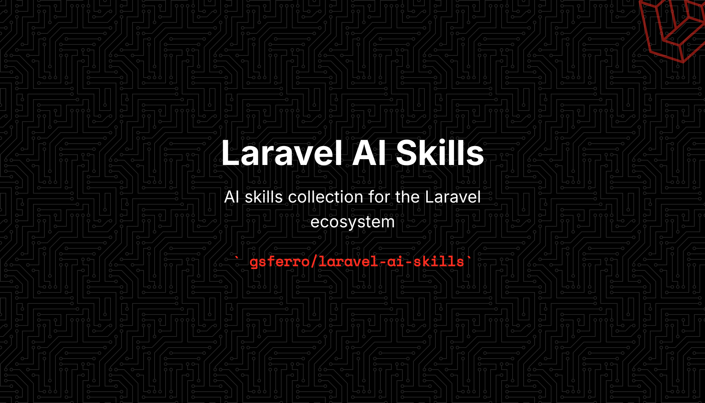

<p align="center">
  
</p>

# Laravel AI Skills Collection 🚀

Uma coletânea de diretrizes de inteligência artificial (Skills) personalizadas para o ecossistema Laravel, focada em boas práticas de arquitetura de software e design patterns.

Estas skills servem para instruir agentes de IA e IDEs avançadas (como Claude Code, Cursor e Copilot) a gerarem códigos exatamente de acordo com os padrões definidos neste repositório.

## 📚 Skills desta coletânea

| Skill | Versão | O que faz | Quando é invocada |
|---|---|---|---|
| **[feature-wiki](.ai/skills/feature-wiki/README.md)** | 3.6.0 | Cria a wiki da feature antes de implementar: requisito bruto, PRD, ADR e progresso, com padrão de log. Delega os casos de teste. No Claude Code, despacha para sub-agentes com modelo roteado e juiz cego | ao iniciar qualquer feature nova |
| **[feature-test-design](.ai/skills/feature-test-design/README.md)** | 1.15.0 | Deriva casos de teste **que matam defeito**, a partir do requisito e nunca do plano: técnica formal por regra, checklist de taxonomia, Gherkin pt-BR e gate de falsificabilidade por mutantes | step 4 da `feature-wiki`, no destino 3 do quality gate, ou para regressão de bug |
| **[feature-quality-gate](.ai/skills/feature-quality-gate/README.md)** | 1.6.0 | **QA no agente**: confronta requisito × plano × app rodando, detecta omissão silenciosa, audita a consistência wiki × código × docs × rules e roteia cada achado para especificação, implementação ou teste | step 8 da `feature-wiki`, após os testes passarem e **antes do PR** |
| **[requirement-to-rule](.ai/skills/requirement-to-rule/README.md)** | 1.3.0 | Transforma decisão/restrição do requisito em **Project Rule** do Laravel Boost (`.ai/rules/`), com aprovação do usuário | step 9 da `feature-wiki` ou sob pedido |

O ciclo completo: **planejar** (`feature-wiki`) → **especificar teste** (`feature-test-design`) → **executar** (Ponytail) → **comunicar** (Caveman) → **testar** (Pest 5) → **validar** (`feature-quality-gate`) → **memorizar** (`requirement-to-rule`).

### Sub-agentes da esteira × modelo (referência)

No Claude Code, a `feature-wiki` (desde a 3.5.0) despacha tarefas para sub-agentes com o modelo roteado por
**complexidade** (quanto raciocínio a tarefa exige) e por **cegueira** (o que o executor não pode ter
visto para o resultado valer como prova). A tabela abaixo é a referência do que cada rota usa; os
aliases (`haiku`, `sonnet`, `opus`) resolvem sempre para a geração corrente de cada família.

| Rota / agente | Skill dona | Alias | Modelo Claude (geração atual) | Tier | Ferramentas | Cegueira |
|---|---|---|---|---|---|---|
| `mecânico` | — (`general-purpose` + `model`) | `haiku` | Claude Haiku 4.5 | econômico | leitura + Bash | — |
| `construtor` | — (`general-purpose` + `model`) | `sonnet` | Claude Sonnet 5 | intermediário | tudo | não edita `00`, `04`, `05` |
| `analista` | — (`general-purpose` + `model`) | `opus` | Claude Opus 5 | topo | leitura + Bash | conforme a tarefa |
| `Explore` (built-in) | — | `sonnet` recomendado | Claude Sonnet 5 | intermediário | leitura | — |
| `fw-revisor-diff` | `feature-wiki` | `opus` | Claude Opus 5 | topo | leitura + Bash, **sem Edit/Write** | não recebe `01`, `03` |
| `fw-executor-ct` | `feature-wiki` | `sonnet` | Claude Sonnet 5 | intermediário | tudo, sob contrato | não lê `01`/`02`; lê `app/` só para nomes; não altera código de aplicação |
| `fw-executor-ctb` | `feature-wiki` | `sonnet` | Claude Sonnet 5 | intermediário | tudo, sob contrato | não altera código de aplicação |
| `fw-adversario-ct` | `feature-test-design` | `opus` | Claude Opus 5 | topo | leitura, **sem Edit/Write/Bash** | recebe só `00` + `04`/`05` |
| `fw-qa-gate` | `feature-quality-gate` | `opus` | Claude Opus 5 | topo | tudo menos Edit/Write/NotebookEdit (herda MCP) | não recebe a conversa |
| sessão principal | — | o da sessão | o que o usuário escolheu (Fable 5.1, Opus 5…) | — | — | orquestra, decide, audita |
| `/code-review` (nativo do Claude Code) | — | o da sessão, por padrão | — | — | isolado por construção | não vê a conversa |

**Tier é o conceito portável; o alias é a implementação Claude.** Em outro host ou provedor, o
projeto mapeia `econômico / intermediário / topo` para os modelos que tiver. Cada disparo registra
o modelo **efetivamente** usado em `## Despachos` do `03-progresso.md`, então o custo de operar é
medível por feature, seja qual for o provedor. Instalação dos agentes:
`cp .ai/skills/*/agents/*.md .claude/agents/` (ver [Como Instalar no Claude Code](#-como-instalar-no-claude-code)).

> Medição de referência (2026-09-21, feature FERRO-830 no `demo-wiki`, esteira completa até o
> quality gate ciclo 1): a maior parte do custo de sub-agente foi `sonnet` construindo; os
> retornos `haiku` com defeito só foram pegos por amostragem; os achados mais graves do `04`
> vieram do `opus` **cego** revisando o que outro `opus` derivou; e o quality gate cego devolveu
> `REPROVADO → especificação` com perguntas de requisito que ninguém tinha feito e **achados
> contra a própria sessão** (número sem comando; degradação declarada falsa). A cegueira pesou
> mais que o modelo. Os números e o registro completo estão em
> [*Validado em campo*](.ai/skills/feature-wiki/references/casos-medidos.md#validado-em-campo--2026-09-21-feature-completa-no-demo-wiki),
> nas `references/` da `feature-wiki`.

### Por que a derivação do teste virou skill própria

O `04-casos-de-teste.md` era escrito logo depois do PRD, pelo mesmo agente, para *"validar os
passos do PRD"*. É a direção invertida: o PRD é a **interpretação** do requisito, e testar a
interpretação a confirma.

Uma auditoria de 9 wikis reais desta coletânea (125 casos de teste) mostrou o efeito: pouco mais
da metade dos casos caía nos arquétipos que o próprio template nomeava, e técnica formal — valor
limite, tabela de decisão, pairwise — praticamente não aparecia. Os números estão no README da
skill, em [O que a auditoria mediu](.ai/skills/feature-test-design/README.md#o-que-a-auditoria-mediu).

A troca foi medida em experimento controlado: 18 defeitos plantados **antes** de qualquer conjunto
existir, julgados por um agente cego que exige citação literal da assertion que mata cada defeito.
Resultado por rodada, da baseline à versão atual, em
[`experimentos/`](experimentos/README.md#histórico).

A causa não era desleixo: o critério de suficiência da skill era *"todo método público tem 1 CT,
cada branch tem um CT"* — cobertura de um **código que ainda não existe** quando o `04` é escrito.
Isso obriga o agente a imaginar a implementação e testá-la.

### Onde está cada documentação

Cada skill tem **dois arquivos com públicos diferentes** — o `README.md` explica para a pessoa; o `SKILL.md` instrui o agente. Procedimento não é duplicado entre eles. Duas skills têm também `references/`: arquivos **para o agente, sob demanda**, que o `SKILL.md` manda abrir antes da ação que depende deles (templates, tabelas, comandos, casos medidos). Os gates e as proibições ficam no `SKILL.md`.

| Skill | Para você ler | Para o agente seguir | Para o agente, sob demanda |
|---|---|---|---|
| feature-wiki | [README](.ai/skills/feature-wiki/README.md) — por quê, os arquivos que ela cria, quando usar, dependências, instalação dos agentes, limites | [SKILL.md](.ai/skills/feature-wiki/SKILL.md) | [`references/`](.ai/skills/feature-wiki/references/) — templates `00`–`03`, padrão de log, pesquisa do step 3, roteamento, Pest 5, citações, casos medidos |
| feature-test-design | [README](.ai/skills/feature-test-design/README.md) — o problema medido, o pipeline de 8 passos (0 a 7), **por que Gherkin sem runner**, a camada Livewire que faltava | [SKILL.md](.ai/skills/feature-test-design/SKILL.md) | [`references/`](.ai/skills/feature-test-design/references/) — técnicas por regra, taxonomia, templates `04`/`05`, mutation testing, `pest-plugin-browser` (fonte única da coletânea) |
| feature-quality-gate | [README](.ai/skills/feature-quality-gate/README.md) — quando usar, limites, dependências + **estudo de viabilidade** (pesquisa de mercado, lacuna verificada, critério eliminatório) | [SKILL.md](.ai/skills/feature-quality-gate/SKILL.md) | — |
| requirement-to-rule | [README](.ai/skills/requirement-to-rule/README.md) — por quê, quando usar/não usar, limites, dependências | [SKILL.md](.ai/skills/requirement-to-rule/SKILL.md) | — |

> Histórico de evolução das skills: [CHANGELOG.md](CHANGELOG.md)

### Como as regras destas skills nascem

Não por releitura de escrivaninha. Cada regra tem um **defeito medido** por trás, num experimento
controlado: requisito com ambiguidades plantadas → catálogo de mutantes escrito **antes** de
qualquer conjunto de teste existir → braços independentes sem contexto compartilhado → **juiz cego**
com citação literal obrigatória → materialização em Pest contra a mesma implementação.

O material completo — protocolo, catálogos, oráculo fixo, prompt do juiz, conjuntos julgados e
vereditos de cada rodada — vive em **[`experimentos/`](experimentos/README.md)**, e é o que permite repetir
a medição a cada evolução em vez de discutir a mudança.

---

## 🏗️ Estrutura do Repositório (Como criar novas Skills)

As skills seguem o [spec Agent Skills](https://agentskills.io/specification). Para que o Laravel Boost e o Claude Code as encontrem, cada uma vive numa pasta própria dentro de `.ai/skills/`:

```text
.ai/
└── skills/
    ├── nome-da-sua-skill/          ← o nome da pasta é o `name` do frontmatter
    │   ├── SKILL.md                ← obrigatório: frontmatter + instruções para o agente
    │   ├── README.md               ← opcional: explicação para a pessoa
    │   ├── references/             ← opcional: arquivos que o SKILL.md manda o agente abrir sob demanda
    │   │   └── tema.md             ←   um nível só: references/tema.md, sem subpasta
    │   └── agents/                 ← opcional: sub-agentes da skill (convenção desta coletânea, não do spec)
    │       └── nome-do-agente.md   ←   o Claude Code só os lê em .claude/agents/ — ver a instalação
    └── outra-skill/
        └── SKILL.md
```

O `boost:add-skill` copia a pasta **inteira** de cada skill (menos arquivos `.php`) para
`.ai/skills/<skill>/` do projeto; do `SKILL.md`, o Boost lê só o `name` e a `description`.

Fora de `.ai/`, o repositório guarda **[`experimentos/`](experimentos/README.md)** (protocolo e
rodadas medidas) e **`estudos/`** (análises comparativas datadas). Nenhum dos dois é instalado
pelo Boost — são o registro de por que cada regra existe.

**Convenção desta coletânea**: cada arquivo tem um público.

| Arquivo | Público | Conteúdo | Custo de contexto |
|---|---|---|---|
| `SKILL.md` | **agente** | gates, obrigações, proibições, a sequência de passos, checklist | o frontmatter (`name` + `description`) está em toda sessão, para o agente decidir invocar; o corpo carrega quando a skill é ativada |
| `references/` | **agente** | templates, tabelas, comandos, exemplos, casos medidos — nunca um gate ou proibição que não esteja também no corpo | só quando o `SKILL.md` manda: *"antes de X, leia `references/Y.md`"* |
| `agents/` | **Claude Code** | sub-agentes com modelo e ferramentas restritos | só no despacho, depois de copiados para `.claude/agents/` |
| `README.md` | **pessoa** | por que existe, quando usar, dependências com versão mínima, limites | **zero** — nenhum agente o carrega por conta própria |

A regra que evita duplicação: **procedimento vive apenas no `SKILL.md`** (e nas `references/` que ele manda abrir). O `README.md` explica o *porquê* e o *quando*, nunca repete o *como*.

### Regras importantes para o arquivo `SKILL.md`

Todo `SKILL.md` começa com um cabeçalho **YAML** delimitado por `---`. É o que descreve a skill para o agente.

**Exemplo prático:**
```markdown
---
name: form-requests-padronizados
description: >
  Valida dados de entrada com Form Requests isolados no domínio do projeto Laravel.
  Invoque ao criar ou alterar endpoint, action ou componente que recebe dados do
  usuário, e quando encontrar validação dentro de controller. Palavras-chave: Form
  Request, validação, rules(), messages(), make:request.
license: MIT
compatibility: Projeto Laravel 10 ou superior.
metadata:
  version: "1.0.0"
  requires: "laravel/framework>=10.0"
---

# Form Requests padronizados

- Sempre utilize o comando `php artisan make:request`.
- Nunca faça validações diretamente dentro das Controllers.
- Antes de escrever as mensagens de erro, leia `references/mensagens.md`: o método `messages()`
  segue o formato dele.
```

- **`name`**: igual ao nome da pasta; até 64 caracteres, minúsculas, dígitos e hífens, sem hífen
  nas pontas nem duplo.
- **`description`**: até 1024 caracteres, dizendo **o que** a skill faz e **quando** invocar, com
  as palavras-chave de gatilho. É o texto que o agente lê em toda sessão; release note e
  procedimento vão para o README e para o corpo.
- **`license`**: `MIT`, a licença do repositório.
- **`compatibility`** (opcional, até 500 caracteres): só exigência real de ambiente — Boost com MCP,
  versão do Pest, sub-agentes — e o que degrada sem ela.
- **`metadata`** (mapa de texto para texto): `version`, convenção desta coletânea — **nunca**
  `version:` no topo, que o validador reprova —, e `requires`, as versões mínimas de outras
  skills e pacotes, separadas por `;`.
- **Caminhos**: arquivo da própria skill, relativo à pasta dela (`references/mensagens.md`).
  Arquivo de outra skill, `{skills}/<skill>/…`, onde **`{skills}`** é o diretório de instalação das
  skills — `.ai/skills/`, `.claude/skills/` ou `~/.claude/skills/`, o primeiro que existir.
- **Tamanho**: o spec recomenda corpo abaixo de 500 linhas, com o resto em `references/`. É
  recomendação, não regra do validador.

Para conferir, rode o mesmo validador que o CI deste repositório
([`.github/workflows/skills-ref.yml`](.github/workflows/skills-ref.yml)) roda em cada push e pull
request — o pacote npm `skills-ref` 0.1.5, port não oficial em TypeScript do `skills-ref`, a
biblioteca de referência do spec (Python, em
[agentskills/agentskills](https://github.com/agentskills/agentskills/tree/main/skills-ref)). As
constantes conferidas batem com as da biblioteca Python (64 / 1024 / 500 caracteres e os mesmos
campos permitidos); as duas se declaram só para demonstração:

```bash
npx -y skills-ref@0.1.5 validate .ai/skills/nome-da-sua-skill
```

---

## ⚙️ Como Instalar no Laravel Boost 2.0

Para instalar **todas as skills de uma vez**, sem prompt de seleção, execute na raiz do seu projeto Laravel:

```bash
php artisan boost:add-skill gsferro/laravel-ai-skills --all
```

Isso copia a pasta **inteira** de cada uma das quatro skills — `SKILL.md`, `README.md`,
`references/` e `agents/`; nada `.php` — para `.ai/skills/<skill>/` do seu projeto. Se o projeto
tem `boost.json`, o próprio `add-skill` termina chamando o `boost:update`, que sincroniza as skills
para a pasta de cada agente configurado no Boost (comportamento do Boost 2.10; o do Claude Code
está em [Como Instalar no Claude Code](#-como-instalar-no-claude-code)). Rodar o `boost:update` à
mão só é preciso se o `add-skill` terminou com erro — e, se o erro foi
[`ProcessTimedOutException`](#se-o-comando-terminar-com-processtimedoutexception), só depois do
ajuste descrito lá, senão ele repete o mesmo timeout:

```bash
php artisan boost:update
```

### Instalação seletiva

Sem o `--all`, o comando abre um prompt para você escolher quais skills instalar:

```bash
php artisan boost:add-skill gsferro/laravel-ai-skills
```

Ou escolha direto pelo nome (o `--skill` aceita repetição):

```bash
php artisan boost:add-skill gsferro/laravel-ai-skills \
  --skill=feature-wiki --skill=feature-test-design --skill=feature-quality-gate
```

> **Atenção**: as skills são encadeadas pela wiki. A `feature-test-design` e a `feature-quality-gate`
> leem o `00-requisito.md` que a `feature-wiki` cria — é o oráculo das duas —, e instalar qualquer
> uma delas sem a `feature-wiki` não funciona. A `requirement-to-rule` lê `01`, `02`, `03` e o
> checklist de taxonomia do `04`.

As versões mínimas entre elas vêm do `metadata.requires` de cada `SKILL.md` e valem quando a
dependência está presente. O que é obrigatório e o que só degrada está na seção *Dependências* do
README de cada skill.

| Skill | `metadata.requires` |
|---|---|
| `feature-wiki` 3.6.0 | `feature-test-design>=1.15.0; feature-quality-gate>=1.5.0; laravel/boost>=2.4.12` |
| `feature-test-design` 1.15.0 | `feature-wiki>=3.5.2` |
| `feature-quality-gate` 1.6.0 | `feature-wiki>=3.5.0; feature-test-design>=1.15.0` |
| `requirement-to-rule` 1.3.0 | `laravel/boost>=2.4.12; feature-wiki>=3.1.0` |

Na prática, instale as quatro juntas: a `feature-wiki` 3.6.0 e a `feature-quality-gate` 1.6.0
apontam para `references/pest-plugin-browser.md`, que só existe a partir da `feature-test-design`
1.15.0. O `laravel/boost` 2.4.12 é a versão em que nasceram as Project Rules e a tool
`record-rule`.

### Todas as opções do `boost:add-skill`

| Opção | O que faz |
|---|---|
| `--all` | instala todas as skills do repositório, sem prompt |
| `--list` | apenas lista as skills disponíveis, sem instalar |
| `--skill=NOME` | instala skills específicas (repetível) |
| `--force` | sobrescreve skills já existentes |
| `--skip-audit` | pula a auditoria de segurança do Boost |

Assinatura completa:

```text
php artisan boost:add-skill [--list] [--all] [--skill [SKILL]] [--force] [--skip-audit] [--] [<repo>]
```

> Após instalar, veja [Padrão de Commit](#-padrão-de-commit-ao-instalaratualizar-skills).

### Se o comando terminar com `ProcessTimedOutException`

Em projeto grande, o `boost:add-skill` pode encerrar com:

```text
The process "php artisan test --list-tests" exceeded the timeout of 60 seconds.
```

**As skills já foram instaladas em `.ai/skills/`** — a tabela `Skills installed` é impressa
**antes** da exceção, e o passo que estoura é posterior à cópia dos arquivos. Confira as versões —
ficam em `metadata.version`, indentadas no frontmatter, por isso o padrão aceita espaço antes (e
também acha uma skill antiga, com `version:` no topo) — e siga:

```powershell
Select-String -Path .ai\skills\*\SKILL.md -Pattern '^\s*version:'
```

```bash
grep -Hn '^[[:space:]]*version:' .ai/skills/*/SKILL.md
```

**O que não foi feito é a sincronização com as pastas dos agentes** (`.claude/skills/` e as
guidelines). O `php artisan test --list-tests` que estoura roda **dentro** do `boost:update` que o
`add-skill` chama: com as guidelines ativas no `boost.json`, o Boost detecta se o projeto tem
testes antes de gravar guidelines e skills, com o timeout padrão de 60 s (Boost 2.10). Por isso
**rodar o `boost:update` de novo repete o mesmo erro**. Defina antes a chave que dispensa a
detecção — `enforce_tests`, override de config não documentado na doc do Boost (laravel/boost
PR #767):

```bash
php artisan vendor:publish --tag=boost-config
# em config/boost.php, dentro do array: 'enforce_tests' => true,
# (true: as guidelines mandam o agente escrever testes; false: não mandam)
php artisan boost:update
```

Com a chave definida, o Boost usa o valor dela e não roda o `test --list-tests`. A alternativa é
espelhar à mão, como no caso *Sem `boost.json`* de [Como Instalar no Claude
Code](#-como-instalar-no-claude-code).

O `--skip-audit` **não** evita esse timeout: quem estoura não é a auditoria. Para saber se a
descoberta de testes do projeto é lenta ou está travando — o que vale investigar por si só —
meça direto: `Measure-Command { php artisan test --list-tests | Out-Null }`.

---

## 🤖 Como Instalar no Claude Code

Você pode disponibilizar e carregar essas diretrizes no **Claude Code** através de duas abordagens:

### Opção 1: Uso Local por Projeto (Recomendado)

Depois do `boost:add-skill` acima, o que falta depende de o Boost estar configurado para o Claude
Code no projeto.

**Com `boost.json` e o Claude Code entre os agentes do Boost.** Se o `add-skill` terminou sem
exceção, ele já chamou o `boost:update`, e o `boost:update` cria cada `.claude/skills/<skill>` como
**symlink** de `.ai/skills/<skill>` (cópia, se o symlink falhar) — comportamento do Boost 2.10. (Se
terminou com `ProcessTimedOutException`, o `.claude/skills/` não foi criado nem atualizado: resolva antes, como em
[Se o comando terminar com `ProcessTimedOutException`](#se-o-comando-terminar-com-processtimedoutexception).)
As skills já estão onde o Claude Code procura; **não copie** `.ai/skills/*` para `.claude/skills/`:
com o symlink no lugar, a cópia escreve a pasta sobre ela mesma. Falta só copiar os sub-agentes:

```bash
mkdir -p .claude/agents/
cp .ai/skills/*/agents/*.md .claude/agents/   # sub-agentes da esteira (revisor do diff, construtor de testes, adversário, QA, CT-B)
ls -la .claude/skills/                        # confira: cada skill como link para .ai/skills/<skill> (ou cópia, se o symlink falhou)
ls .claude/agents/fw-*.md                     # confira: os agentes só carregam do diretório onde a sessão abre
```

No **PowerShell** (`mkdir -p` e `cp` com glob não existem como no bash):

```powershell
New-Item -ItemType Directory -Force .claude\agents | Out-Null
Copy-Item -Force .ai\skills\*\agents\*.md .claude\agents\
Get-Item .claude\skills\* | Select-Object Name, LinkType, Target
Get-ChildItem .claude\agents\fw-*.md        # cinco arquivos
```

**Sem `boost.json`, ou com o Claude Code fora dos agentes do Boost.** Nada sincroniza
`.claude/skills/`; espelhe à mão, com a pasta inteira de cada skill (as `references/` precisam ir
junto — o `SKILL.md` manda o agente abri-las):

```bash
mkdir -p .claude/skills/ .claude/agents/
cp -R .ai/skills/* .claude/skills/
cp .ai/skills/*/agents/*.md .claude/agents/
ls .claude/agents/fw-*.md
```

```powershell
New-Item -ItemType Directory -Force .claude\skills, .claude\agents | Out-Null
Copy-Item -Recurse -Force .ai\skills\* .claude\skills\
Copy-Item -Force .ai\skills\*\agents\*.md .claude\agents\
Get-ChildItem .claude\agents\fw-*.md        # cinco arquivos
```

Nesse caso, a cópia de `.claude/skills/` também se repete a cada atualização das skills.

> **Os sub-agentes exigem a cópia, nos dois casos.** O Claude Code lê agentes só em
> `.claude/agents/`, nunca em `.ai/skills/*/agents/` — e o `boost:update` sincroniza skills, não
> agentes. Cada skill traz o seu agente na própria pasta `agents/` (para o Boost instalá-lo junto),
> então **repita a cópia dos agentes a cada `boost:add-skill`** — sem ela, os cinco agentes `fw-*`
> não existem para o Claude Code (o que acontece então está no parágrafo *Sem a cópia*, abaixo).
>
> **Verificar que a sessão os carregou** é outra coisa: a lista de sub-agentes é resolvida quando a
> sessão **abre**, então agente copiado com a sessão em pé não aparece. Reinicie o Claude Code e
> peça na própria sessão — *"despache o `fw-adversario-ct` para listar as ferramentas que ele
> tem"*. Se não estiver registrado, o erro é explícito (`Agent type 'fw-adversario-ct' not found`,
> com a lista dos disponíveis). O wizard `/agents` foi removido do Claude Code; a verificação por
> despacho funciona em qualquer versão.
>
> Sem a cópia, a `feature-wiki` não encontra `fw-revisor-diff`, `fw-executor-ct`, `fw-adversario-ct`, `fw-qa-gate`
> nem `fw-executor-ctb`, e cai no `general-purpose` com `model` explícito (funciona — segurou uma
> feature inteira em 2026-09-21 — mas sem a restrição de ferramenta que torna "quem julga não
> conserta" mecânico). A sessão precisa estar aberta **no diretório do projeto**: agente em
> `.claude/agents/` de um diretório pai ou de outro repositório não é visto.

### Opção 2: Instalação Global no Sistema
Para que o Claude Code use estas regras de arquitetura em **qualquer diretório** que você abrir na sua máquina, instale a pasta de skills diretamente no seu perfil de usuário:

* **Linux / macOS:**
  ```bash
  mkdir -p ~/.claude/skills/ ~/.claude/agents/
  # Clone o repositório e mova o conteúdo para a pasta global
  cp -R .ai/skills/* ~/.claude/skills/
  cp .ai/skills/*/agents/*.md ~/.claude/agents/   # sub-agentes da esteira, como na Opção 1
  ```
* **Windows (PowerShell):**
  ```powershell
  New-Item -ItemType Directory -Force -Path "$HOME\.claude\skills", "$HOME\.claude\agents"
  Copy-Item -Path ".\.ai\skills\*" -Destination "$HOME\.claude\skills" -Recurse -Force
  Copy-Item -Force .ai\skills\*\agents\*.md "$HOME\.claude\agents\"
  ```

> Copie sempre a pasta **inteira** de cada skill, como acima: copiar só o `SKILL.md` deixa os
> *"leia `references/…`"* apontando para o vazio. Instalação global é `{skills}` =
> `~/.claude/skills/`: as skills procuram umas às outras em `.ai/skills/`, `.claude/skills/` e
> `~/.claude/skills/`, nessa ordem.

> Instalação como plugin do Claude Code (`/plugin marketplace add`): ainda não disponível — o repositório não publica manifesto de marketplace.

---

## 📌 Padrão de Commit ao Instalar/Atualizar Skills

Ao baixar ou atualizar skills deste repositório no seu projeto, use o padrão de commit abaixo para manter o histórico rastreável:

### Instalação (primeira vez)

```
:package: skills: instala {nome-da-skill} do laravel-ai-skills

- Origem: https://github.com/gsferro/laravel-ai-skills
- Versão/commit: {sha-curto ou tag}
```

### Atualização

```
:arrow_up: skills: atualiza {nome-da-skill} do laravel-ai-skills

- Origem: https://github.com/gsferro/laravel-ai-skills
- De: {sha-anterior} → Para: {sha-novo}
- Mudanças relevantes: {resumo em 1 linha}
```

### Exemplos

```
:package: skills: instala feature-wiki do laravel-ai-skills
:arrow_up: skills: atualiza feature-wiki do laravel-ai-skills
```

> Instalando/atualizando várias skills de uma vez, use o escopo `skills` no plural
> e liste cada uma no corpo do commit.

Ajustes possíveis: se quiser manter só os gitmojis do seu padrão interno (sem :package:/:arrow_up:), troque por :sparkles: (instala) e :recycle: (atualiza).


---
## 🐴 Integração com Ponytail + 🦴 Caveman (Planejar → Executar → Comunicar com Mínimo Esforço)

### O que é o Ponytail?

**Ponytail** ([github.com/DietrichGebert/ponytail](https://github.com/DietrichGebert/ponytail)) é uma skill de execução que faz o agente de IA pensar como o **dev sênior mais preguiçoso da sala** — no bom sentido. Antes de escrever qualquer código, o agente sobe uma "escada de simplicidade":

1. **Isso precisa existir?** (YAGNI) → se não, skip
2. **Já existe no codebase?** → reutiliza, não reescreve
3. **A stdlib faz?** → usa
4. **Feature nativa da plataforma cobre?** → usa (`<input type="date">` em vez de lib de datepicker)
5. **Dependência já instalada resolve?** → usa
6. **Pode ser uma linha?** → uma linha
7. **Só então:** o mínimo de código que funciona

O Ponytail **nunca** corta validação de input em fronteiras de confiança, tratamento de erros que previne perda de dados, segurança ou acessibilidade. Preguiça na solução, nunca na leitura do problema.

### O que é o Caveman?

**Caveman** ([github.com/JuliusBrussee/caveman](https://github.com/JuliusBrussee/caveman)) é uma skill de comunicação que corta ~75% dos tokens na prosa do agente — removendo artigos, fillers, pleasantries e hedging — mantendo precisão técnica. Tem níveis de intensidade (lite/full/ultra) e regras de Auto-Clarity que desativam o modo terse em situações críticas.

O próprio Ponytail recomenda o pareamento: *"Ponytail governs what you build, not how you talk (pair with Caveman for terse prose)"*.

- **Caveman** → prosa. Corta fluff da comunicação.
- **Ponytail** → código. Corta over-engineering da solução.

### Por que feature-wiki, Ponytail e Caveman trabalham bem juntas

A integração é natural porque cada skill opera em uma **camada complementar** do ciclo de desenvolvimento:

| Camada | Skill | Responsabilidade | Boundary |
|--------|-------|------------------|----------|
| **Comunicação** (agent ↔ usuário) | Caveman | Prosa terse — corta fluff, artigos, fillers | **NÃO aplica em arquivos wiki** (00-06), código, commits, PRs |
| **Planejamento** (documentação) | feature-wiki | Define o **o quê** e o **porquê**: requisito, PRD, ADR, tracking, padrão de log, channel por feature | Arquivos wiki são detalhados por design — compressão cria ambiguidade |
| **Especificação de teste** | feature-test-design | Define **o que provaria que está errado**: técnica formal por regra, e o gate de mutantes | Deriva do requisito, nunca do plano — testar o plano confirma o plano |
| **Execução** (código) | Ponytail | Define o **como**: mínimo código possível, sem over-engineering, reutilização antes de criação | Não corta validação, segurança, tratamento de erros |
| **Revisão** (diff) | Ponytail (`/ponytail:ponytail-review`) | Valida o diff contra over-engineering: o que cortar, o que substituir por stdlib | — |

O Ponytail diz *"leia o problema completamente antes de escolher o rung mais preguiçoso"*. A feature-wiki **é** essa leitura profunda — ela força o agente a pesquisar o codebase, validar premissas, inspecionar APIs e escrever casos de teste **antes** de tocar em código. Quando o Ponytail assume a execução, o agente já tem contexto completo da wiki e pode aplicar a escada de simplicidade com confiança, sem risco de "preguiça que pula compreensão". O Caveman mantém a comunicação terse durante toda a sessão — mas respeita o boundary dos arquivos wiki.

Sem a feature-wiki, o Ponytail pode escolher o rung errado por falta de contexto. Sem o Ponytail, a feature-wiki pode produzir um plano detalhado que o agente super-engineering na implementação. Sem o Caveman, a sessão perde tokens com fluff na prosa. Juntas: **planejamento minucioso + execução minimalista + comunicação terse**.

### Boundary do Caveman em arquivos wiki

O Caveman tem Auto-Clarity que desativa o modo terse em situações críticas. Mas a feature-wiki torna explícito:

> **Arquivos wiki são boundary do Caveman.**
>
> - `01-plano-acao.md` — PRD precisa ser "minucioso o suficiente para um agente implementar sem ambiguidade". Compressão destrói essa propriedade.
> - `02-decisoes-arquiteturais.md` — ADR é argumentativo por natureza. Fragmentos perdem o raciocínio.
> - `03-progresso.md` — Checklists e descrições de blockers/desvios precisam de clareza.
> - `04-casos-de-teste.md` — CTs já são estruturados, mas a prosa explicativa não deve ser comprimida.
> - `05-casos-de-teste-browser.md` — o roteiro de CT-B é seguido passo a passo por humano ou agente; ambiguidade aqui invalida a auditoria.
> - `05-*.md` — Arquivos extras (rollback, performance, security) são críticos e não podem ser ambíguos.

**Onde Caveman é bem-vindo**: conversa agent ↔ usuário, resumos de progresso, perguntas e confirmações, respostas a dúvidas rápidas.

### Passo a Passo da Integração

#### 1. Instalar as skills desta coletânea no seu projeto

```bash
php artisan boost:add-skill gsferro/laravel-ai-skills --all
```

Isso baixa `feature-wiki`, `feature-test-design`, `feature-quality-gate` e `requirement-to-rule` para `.ai/skills/` no seu projeto Laravel. Com `boost.json`, o próprio `add-skill` termina chamando o `boost:update`; rodá-lo à mão só se o `add-skill` terminou com erro (ver [Como Instalar no Laravel Boost 2.0](#️-como-instalar-no-laravel-boost-20)). Sem `boost.json`, o `boost:update` falha (*Please set up Boost with [php artisan boost:install] first*).

#### 2. Instalar o Ponytail e o Caveman no seu agente de IA

Escolha **uma** das opções abaixo conforme o agente que você usa:

**Claude Code:**
```text
/plugin marketplace add DietrichGebert/ponytail
```
Depois, em um segundo prompt:
```text
/plugin install ponytail@ponytail
```

**Windsurf / Cursor / Cline:**
Copie o arquivo de regras do Ponytail para a pasta do seu agente:
```bash
# Windsurf
curl -o .windsurf/rules/ponytail.md https://raw.githubusercontent.com/DietrichGebert/ponytail/main/.windsurf/rules/ponytail.md

# Cursor
curl -o .cursor/rules/ponytail.md https://raw.githubusercontent.com/DietrichGebert/ponytail/main/.cursor/rules/ponytail.mdc

# Cline
curl -o .clinerules/ponytail.md https://raw.githubusercontent.com/DietrichGebert/ponytail/main/.clinerules/ponytail.md
```

**GitHub Copilot (editor):**
```bash
curl -o .github/copilot-instructions.md https://raw.githubusercontent.com/DietrichGebert/ponytail/main/.github/copilot-instructions.md
```

**AGENTS.md (universal — CodeWhale, Codex, VS Code):**
```bash
curl -o AGENTS.md https://raw.githubusercontent.com/DietrichGebert/ponytail/main/AGENTS.md
```

**Caveman — Claude Code:**
```text
/plugin marketplace add JuliusBrussee/caveman
```
Depois, em um segundo prompt:
```text
/plugin install caveman@caveman
```

**Caveman — Windsurf / Cursor / Cline:**
```bash
# Windsurf
curl -o .windsurf/rules/caveman.md https://raw.githubusercontent.com/JuliusBrussee/caveman/main/.windsurf/rules/caveman.md

# Cursor
curl -o .cursor/rules/caveman.md https://raw.githubusercontent.com/JuliusBrussee/caveman/main/.cursor/rules/caveman.mdc

# Cline
curl -o .clinerules/caveman.md https://raw.githubusercontent.com/JuliusBrussee/caveman/main/.clinerules/caveman.md
```

#### 3. Espelhar a skill feature-wiki para o Claude Code (se aplicável)

Se você usa Claude Code junto com Laravel Boost (é a Opção 1 de *Como Instalar no Claude Code*).
Com `boost.json` e o Claude Code configurado no Boost, o `boost:update` que o `add-skill` do passo 1 chama já criou
`.claude/skills/<skill>` como symlink (Boost 2.10); falta só copiar os sub-agentes:

```bash
mkdir -p .claude/agents/
cp .ai/skills/*/agents/*.md .claude/agents/   # sub-agentes da esteira (ver Opção 1)
```

Sem `boost.json`, espelhe também as skills, com a pasta inteira de cada uma:

```bash
mkdir -p .claude/skills/ .claude/agents/
cp -R .ai/skills/* .claude/skills/
cp .ai/skills/*/agents/*.md .claude/agents/
```

#### 4. Fluxo de trabalho integrado

A partir de agora, para cada feature nova:

```
┌─────────────────────────────────────────────────────┐
│  1. PLANEJAR (feature-wiki)                         │
│  ─────────────────────────────────                  │
│  • Invocar feature-wiki ao iniciar a feature        │
│  • Criar wikis/specs/{branch}/{feature}/ com 7 arqs │
│    (00 a 06 — 04/05/06 chegam nos passos abaixo)    │
│  • 00-requisito.md       → requisito bruto IMUTÁVEL  │
│    - Decomposição em cláusulas RQ-##                │
│    - Ambiguidades = pergunta, não suposição         │
│  • 01-plano-acao.md      → PRD detalhado            │
│    - Natureza da wiki + Cobertura do Requisito      │
│    - Autorização, Rotas, Env, Eventos, Jobs         │
│    - Impacto, Rollback, Dependências, Riscos        │
│    - Logs em todas as etapas (channel + padrão)     │
│  • 02-decisoes-arquiteturais.md → formato ADR       │
│  • 03-progresso.md       → checklist + Blockers     │
│  • Revisão profunda pós-escrita                     │
│  • Auditoria da wiki: /ponytail:ponytail-review     │
│  • Confirmar plano com usuário                      │
│  ⚠️ Caveman OFF nos arquivos wiki                  │
└──────────────────────┬──────────────────────────────┘
                       │
                       ▼
┌─────────────────────────────────────────────────────┐
│  2. ESPECIFICAR TESTE (feature-test-design)         │
│  ─────────────────────────────────                  │
│  • Invocada no step 4 da wiki                       │
│  • Entrada: 00-requisito.md é o ORÁCULO             │
│    - o PRD entra só para path, rota e superfície    │
│  • Perfil por risco (P×I) → mínimo/padrão/completo  │
│  • Varredura SFDIPOT (7 dimensões declaradas)       │
│  • Mapa de regras: regra / exemplo / pergunta       │
│  • Técnica formal POR REGRA:                        │
│    - partição · valor limite 3-valores              │
│    - tabela de decisão · estado × operação          │
│    - matriz papel×ação · pairwise · efeito          │
│  • Checklist de taxonomia (IDOR, idempotência,      │
│    concorrência, timezone, soft delete, monetário)  │
│  • Cenários em Gherkin pt-BR (Regra → Cenário)      │
│  • GATE: toda regra declara os mutantes plausíveis  │
│    e aponta o cenário que mata cada um              │
│  • Camada mais barata que prova + poda              │
│  • Revisão adversarial por sub-agente independente  │
│  → 04-casos-de-teste.md                             │
│  → 05-casos-de-teste-browser.md (só o que exige     │
│     navegador: JS, console, a11y, cor/layout)       │
└──────────────────────┬──────────────────────────────┘
                       │
                       ▼
┌─────────────────────────────────────────────────────┐
│  3. EXECUTAR (Ponytail)                             │
│  ─────────────────────────────────                  │
│  • Ponytail ativo em modo full (padrão)             │
│  • Caveman ativo (ultra) na comunicação c/ usuário  │
│  • Seguir o 01-plano-acao.md passo a passo          │
│  • Aplicar a escada de simplicidade em cada passo:  │
│    - Reutilizar antes de criar                      │
│    - Stdlib antes de código custom                  │
│    - Feature nativa antes de dependência            │
│    - Uma linha quando possível                      │
│  • Marcar atalhos com `ponytail:` comment           │
│  • Atualizar 03-progresso.md em tempo real          │
└──────────────────────┬──────────────────────────────┘
                       │
                       ▼
┌─────────────────────────────────────────────────────┐
│  4. REVISAR (Ponytail-review)                       │
│  ─────────────────────────────────                  │
│  • /ponytail:ponytail-review no diff atual           │
│  • Receber lista de cortes: delete, stdlib, native, │
│    yagni, shrink                                    │
│  • Aplicar cortes sugeridos                         │
│  • /ponytail:ponytail-audit se quiser varrer o repo  │
│  • /ponytail:ponytail-debt para coletar atalhos      │
└──────────────────────┬──────────────────────────────┘
                       │
                       ▼
┌─────────────────────────────────────────────────────┐
│  5. TESTAR E COMMITAR                               │
│  ─────────────────────────────────                  │
│  • Rodar testes dos CTs (04-casos-de-teste.md)      │
│  • vendor/bin/pint --dirty                          │
│  • vendor/bin/pest --filter={Feature} --compact     │
│  • vendor/bin/pest tests/Browser (se houver CT-B)   │
│  • vendor/bin/pest --tia → confirma impacto real    │
│  • Commit com gitmoji + escopo                      │
│  • :memo: wiki: atualiza 03-progresso.md            │
└──────────────────────┬──────────────────────────────┘
                       │
                       ▼
┌─────────────────────────────────────────────────────┐
│  5.5 REVISAR O DIFF (feature-wiki, step 6.5)        │
│  ─────────────────────────────────                  │
│  • Logo após os testes passarem, antes do step 7    │
│  • /code-review high {base}...HEAD (genérico)       │
│  • fw-revisor-diff (opus, sem Edit/Write): eixos    │
│    Laravel/Livewire/tenant — CEGO ao PRD: não vê    │
│    01, 03 nem o raciocínio da sessão                │
│  • Achado confirmado → Adendo · CT · correção       │
│  • Ordem fixa: 6.5 → 7 → 8 → PR                     │
└──────────────────────┬──────────────────────────────┘
                       │
                       ▼
┌─────────────────────────────────────────────────────┐
│  6. PÓS-IMPLEMENTAÇÃO (feature-wiki, step 7)        │
│  ─────────────────────────────────                  │
│  • Atualizar 03-progresso.md (checkboxes + data)    │
│  • CT-B via sub-agente em loop (máx. 3 iterações)   │
│    - Preencher Desenhado × Implementado             │
│  • Documentar desvios do plano e notas              │
│  • Retrospectiva breve                              │
│  • Ajustar channel de log (level ou remoção)        │
└──────────────────────┬──────────────────────────────┘
                       │
                       ▼
┌─────────────────────────────────────────────────────┐
│  7. VALIDAR (feature-quality-gate, step 8)          │
│  ─────────────────────────────────                  │
│  • Confronta 00-requisito × PRD × app rodando       │
│  • Audita ambiguidades do requisito PRIMEIRO        │
│  • Matriz de Rastreabilidade → omissão silenciosa   │
│  • 12 dimensões (perfil por risco: mín/padrão/full) │
│  • Roteia achado: especificação | código | teste    │
│  • Escreve 06-relatorio-qa.md + veredito            │
│  • Veredito APROVADO → abrir o PR e linkar a wiki   │
│  ⚠️ NÃO corrige nada · teto de 3 ciclos             │
└──────────────────────┬──────────────────────────────┘
                       │
                       ▼
┌─────────────────────────────────────────────────────┐
│  8. MEMORIZAR (requirement-to-rule, step 9)         │
│  ─────────────────────────────────                  │
│  • Varrer ADRs + Notas + PRD por candidatos a rule  │
│  • Aplicar os 4 gates: durável, escopável,          │
│    não-inferível, não-redundante                    │
│  • Preferir enforcement (arch() do Pest) à prosa    │
│  • APRESENTAR ao usuário — decisão é dele           │
│  • Se aprovado: gravar via record-rule (Boost)      │
│  • Commitar .ai/rules/ (artefato de equipe)         │
│  ⚠️ Teto: 3 candidatos apresentados                 │
└─────────────────────────────────────────────────────┘
```

#### 5. Referenciar o Ponytail e o Caveman no PRD da feature-wiki

Ao escrever o `01-plano-acao.md`, incluir uma nota de filosofia de implementação:

```markdown
## Filosofia de Implementação

> **Ponytail ativo em modo `full`** durante toda a implementação.
> Cada passo deve aplicar a escada de simplicidade:
> 1. Reutilizar código existente antes de criar novo
> 2. Usar stdlib do PHP/Laravel antes de código custom
> 3. Usar features nativas (ex: `input[type=date]`) antes de dependências
> 4. Uma linha quando possível
> 5. Mínimo código que funciona
>
> Atalhos deliberados devem ser marcados com `ponytail:` comment.
> Após implementação, rodar `/ponytail:ponytail-review` no diff.
>
> **Caveman ativo em modo `ultra`** (padrão) na comunicação agent ↔ usuário.
> Arquivos wiki (00-06) são boundary do Caveman — escrever em prosa normal.
> Código, commits e PRs também são boundary do Caveman.
```

#### 6. Comandos do Ponytail e Caveman durante a implementação

| Comando | Quando usar |
|---------|-------------|
| `/ponytail:ponytail` | Verificar modo ativo ou alternar intensidade |
| `/ponytail:ponytail full` | Modo padrão — escada enforced, stdlib primeiro |
| `/ponytail:ponytail ultra` | YAGNI extremo — para features simples ou refactors agressivos |
| `/ponytail:ponytail lite` | Constrói o pedido mas sugere alternativa mais simples |
| `/ponytail:ponytail-review` | Revisar o diff atual por over-engineering |
| `/ponytail:ponytail-audit` | Auditar o repo inteiro por complexidade |
| `/ponytail:ponytail-debt` | Coletar todos os `ponytail:` comments em um ledger |
| `/caveman:caveman ultra` | **Modo padrão** — compressão máxima da prosa |
| `/caveman:caveman lite\|full\|ultra` | Alternar intensidade da prosa terse |
| `/caveman:caveman off` / `stop caveman` | Desativar Caveman temporariamente |

> ⚠️ **Namespace obrigatório no Claude Code**: comandos vindos de plugin exigem o prefixo `{plugin}:` — `/caveman:caveman` e `/ponytail:ponytail`. Sem o namespace (`/caveman`, `/ponytail-review`) o comando não é encontrado.
>
> Os READMEs upstream documentam `/caveman` e `/ponytail` sem prefixo porque cobrem também a instalação via arquivo de regras (Windsurf / Cursor / Cline), onde não existe namespace de plugin. Se você instalou via `/plugin install caveman@caveman`, use sempre `/caveman:caveman`. O mesmo vale para os demais comandos do plugin: `/caveman:caveman-review`, `/caveman:caveman-stats`, `/caveman:caveman-init`.

#### 7. Configurar modo padrão do Ponytail (opcional)

Defina o modo padrão para todas as sessões novas:

**Variável de ambiente:**
```bash
export PONYTAIL_DEFAULT_MODE=full
```

**Arquivo de config:**
- **Linux/macOS:** `~/.config/ponytail/config.json`
- **Windows:** `%APPDATA%\ponytail\config.json`

```json
{ "defaultMode": "full" }
```

### Resumo da Integração

Versão atual de cada skill: na [tabela do topo](#-skills-desta-coletânea).

```
feature-wiki             Ponytail              Caveman
─────────────────        ─────────────────     ─────────────────
Planejamento minucioso   Execução minimalista  Comunicação terse
00-requisito (oráculo)    Escada de simplicidade  Corta fluff da prosa
PRD + ADR                 /ponytail:ponytail-review  Auto-Clarity ativa
Padrão de log             /ponytail:ponytail-debt    Boundary: wiki/code
Revisão pós-escrita                              /commits = prosa normal
03-progresso.md tracking

feature-test-design
─────────────────
Deriva do REQUISITO, nunca do plano
SFDIPOT · mapa de regras · técnica formal
Gate: mutante previsto → cenário que mata
Gherkin pt-BR · camada mais barata que prova
Revisão adversarial por sub-agente

feature-quality-gate               requirement-to-rule
─────────────────                  ─────────────────
Requisito × plano × app rodando    Decisão da wiki → .ai/rules/
Omissão silenciosa (Matriz)        4 gates + aprovação do usuário
12 dimensões, perfil por risco     Gravado via record-rule (Boost)
Dimensão K: a suíte pega defeito?  Índice .ai/rules/index.md
Roteia: spec | código | teste
Não corrige · teto de 3 ciclos
         │                    │                      │
         └────────────┬───────┴──────────────────────┘
                      ▼
          Código correto + enxuto + comunicado com terseza
          Planejado com detalhe,
          executado com o mínimo necessário,
          comunicado sem fluff
```

---

## 📖 Documentação detalhada

Este README é o índice da coletânea. O detalhe de cada skill vive com ela:

| Documento | O que você encontra |
|---|---|
| [**feature-wiki**](.ai/skills/feature-wiki/README.md) | por que a skill existe e o que entrega, os arquivos da wiki (00 a 06), quando usar, dependências com versão mínima e o que degrada sem cada uma, instalação dos agentes, como ela está organizada (`SKILL.md` × `references/` × `agents/`), limites, e o porquê das escolhas: sub-agentes no Claude Code, requisito verbatim (card colado, `.pdf`/`.docx`/`.md`), arquivo próprio para teste de browser, `search-docs` como primeira fonte |
| [**feature-test-design**](.ai/skills/feature-test-design/README.md) | o problema medido (a auditoria de 9 wikis reais, em [O que a auditoria mediu](.ai/skills/feature-test-design/README.md#o-que-a-auditoria-mediu)), o pipeline de 8 passos (0 a 7), **por que Gherkin sem runner**, por que uma skill separada da `feature-wiki`, a camada de componente Livewire que faltava, onde estão os fatos do `pest-plugin-browser` ([`references/pest-plugin-browser.md`](.ai/skills/feature-test-design/references/pest-plugin-browser.md), fonte única da coletânea), o que foi medido (com link para [`experimentos/`](experimentos/README.md#histórico)), o que a skill não faz e dependências |
| [**feature-quality-gate**](.ai/skills/feature-quality-gate/README.md) | quando usar, o que ela entrega (omissão silenciosa, veredito, destino por achado), limites, dependências com versão mínima, instalação do sub-agente **e** o estudo de viabilidade completo: pesquisa de mercado, lacuna verificada, achados técnicos e critério eliminatório |
| [**requirement-to-rule**](.ai/skills/requirement-to-rule/README.md) | por que existe (wiki da feature × rule × guideline), quando usar e quando não usar, relação com o `infer-conventions`, limites, dependências com versão mínima; gates, escada, índice e modelo da rule ficam no `SKILL.md` |
| [**CHANGELOG.md**](CHANGELOG.md) | histórico de evolução das quatro skills, com versionamento independente e convenção de tags |

---

## 📄 Licença

Este projeto está sob a licença MIT. Veja o arquivo [LICENSE](LICENSE) para mais detalhes.
